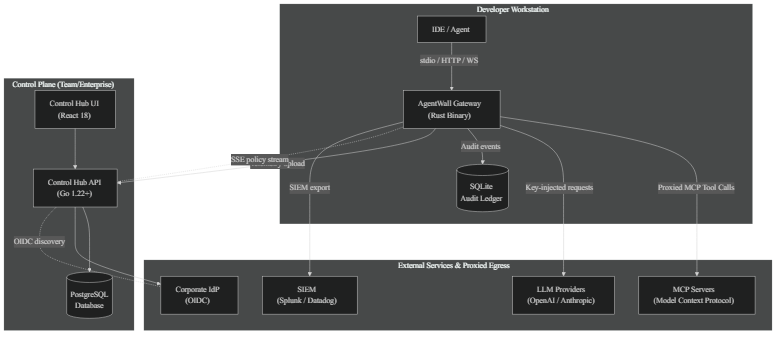

<h1 align="center">Vexa AgentWall</h1>

<p align="center">
  <strong>Enterprise-Grade Default-Deny AI Security Gateway & Firewall for MCP, HTTP, HTTPS, and WebSockets</strong>
</p>

<p align="center">
  Vexa AgentWall intercepts, sandboxes, audits, and actively enforces strict security policies on AI agent tool calls and outbound LLM API traffic across developer workstations, team staging environments, and production fleets. It features persistent OS Sentry daemon watching, hardware-bound Ed25519 PKI device enrollment, continuous <300ms self-healing file re-wrapping, inline DLP scanning, stateful multi-step sequence rules, OIDC identity binding, centralized API key custody, HMAC-chained tamper-evident audit logging, passive shadow discovery mode with Risk Delta reporting, verified MCP security scoring, Human-in-the-Loop policy escalation with HMAC-signed webhook callbacks, hardened WebSocket egress tunneling, real-time AI threat intelligence feed integration, multi-tenant project and task policy sharding, zero-knowledge customer-managed-key SIEM export, a pre-built Hardened Agent Container Runtime (HAR) for Kubernetes deployments, and a built-in ADR (AI Detection & Response) security benchmark suite.
</p>

<p align="center">
  <a href="LICENSE"></a>
  <a href="Cargo.toml"></a>
  <a href="https://www.rust-lang.org/"></a>
  <a href="https://go.dev/"></a>
  <a href="https://react.dev/"></a>
  <a href="docs/owasp_agentic_top10.md"></a>
  <a href="docs/README.md"></a>
</p>

<p align="center">
  <a href="#quick-start">Quick start</a> ·
  <!-- <a href="#client-sdks">Client SDKs</a> · -->
  <a href="#cloud-serverless-deployments-terraform">Cloud (AWS/Azure/GCP)</a> ·
  <a href="#why-vexa-agentwall">Why Vexa AgentWall</a> ·
  <a href="#capabilities-by-operating-profile">Capabilities</a> ·
  <a href="#how-it-works">How it works</a> ·
  <a href="#security-and-control">Security & Control</a> ·
  <a href="#owasp-agentic-top-10-asi-2026-compliance">OWASP Compliance</a> ·
  <a href="#deployment-options">Deployment options</a> ·
  <a href="docs/README.md">Documentation</a>
</p>

---

## Quick start

Vexa AgentWall can be deployed across multiple environments: as a zero-config standalone CLI sidecar on a developer workstation, via Docker Compose for engineering teams, as a Kubernetes Helm release for enterprise production fleets, or built directly from source.

### Standalone Developer CLI

Install the statically-linked `agentwall` binary and launch the shadow gateway with an embedded web dashboard:

**macOS / Linux / WSL:**
```bash
# Standalone CLI Developer Workstation
curl -fsSL https://raw.githubusercontent.com/noviqtechnologies/agentwall/main/install/cli.sh | bash
agentwall protect

# Enterprise Team OTET Provisioning (Enrollment & Sentry Daemon)
curl -fsSL https://raw.githubusercontent.com/noviqtechnologies/agentwall/main/install/team_otet.sh | bash -s -- -t "TOK-YOUR-TOKEN" -u "http://agentwall-ecs-alb-1035383404.eu-west-1.elb.amazonaws.com:8080"
```

**Windows (PowerShell):**
```powershell
# Standalone CLI Developer Workstation
irm https://raw.githubusercontent.com/noviqtechnologies/agentwall/main/install/cli.ps1 | iex
agentwall.exe protect

# Enterprise Team OTET Provisioning (Enrollment & Sentry Daemon)
$env:AGENTWALL_TOKEN = "TOK-YOUR-TOKEN"
$env:DASHBOARD_API_URL = "http://agentwall-ecs-alb-1035383404.eu-west-1.elb.amazonaws.com:8080"
irm https://raw.githubusercontent.com/noviqtechnologies/agentwall/main/install/team_otet.ps1 | iex
```

Open `http://127.0.0.1:8080` in your browser to inspect live traffic, parameter schema telemetry, risk flags, DLP findings, and policy generator tools.

> 💡 **Generating Instant Test Telemetry**: Running the optional demonstration test script requires **Python 3.8+**. The installer places `quickstart_agent.py` in your local binary path (`~/.local/bin` / `%USERPROFILE%\.local\bin`). If you see *"No tool calls recorded yet"*, run the test script in a new terminal:
> 
> **macOS / Linux / WSL:**
> ```bash
> python3 ~/.local/bin/quickstart_agent.py
> ```
> 
> **Windows (PowerShell):**
> ```powershell
> python "$env:USERPROFILE\.local\bin\quickstart_agent.py"
> ```

### One-Command IDE Protection (`agentwall protect`)

After installing AgentWall, you can secure your entire AI development environment in a single command. `agentwall protect` automatically discovers all supported IDEs (Cursor, Claude Desktop, VS Code, JetBrains, Zed, Cline, OpenCode, Antigravity), creates timestamped config backups, injects the proxy, starts the gateway, and opens the Local Dashboard in your browser:

**macOS / Linux:**
```bash
agentwall protect

# Preview all changes before writing (dry run)
agentwall protect --dry-run

# Start immediately in enforce (active blocking) mode
agentwall protect --enforce
```

**Windows (PowerShell):**
```powershell
agentwall.exe protect
agentwall.exe protect --dry-run
agentwall.exe protect --enforce
```

To restore all IDE configurations from their backups:
```bash
agentwall unprotect           # macOS / Linux
agentwall.exe unprotect       # Windows
agentwall.exe unprotect --force  # Skip backup integrity check (emergency recovery)
```

**Local Dashboard highlights** (auto-opens at `http://127.0.0.1:8080`):
- 🔄 **Shadow ↔ Enforce toggle** — switch security posture live without restarting
- 💰 **Live Spend** — real-time LLM token cost accumulator
- 🛡 **Risks Blocked** — live count of denied injections, sensitive reads, and policy violations
- 🎯 **Mission Mode** — guided test: ask your AI to read `/etc/shadow` to prove real-time blocking
- 🪄 **Quick Policy** — one-click security rule generator per tool in the inventory table


<!--
### Client SDKs (Python)

Integrate your AI agents directly with AgentWall's out-of-process security proxy:

**Python (`vexaagentwall`):**
```python
# pip install vexaagentwall
from agentwall import AgentWallClient, AgentWallDenied

client = AgentWallClient() # Auto-discovers local proxy on 127.0.0.1:8080

@client.governed
def read_project_file(path: str) -> str:
    with open(path, "r") as f:
        return f.read()

try:
    content = read_project_file("/workspace/README.md")
except AgentWallDenied as e:
    print(f"Blocked by policy: {e.rule_name} — {e.reason}")
```
-->

### Team / Staging Control Hub (Docker Compose)

Deploy the self-hosted Control Hub stack (Go REST API, React Management Console, PostgreSQL database) alongside gateway instances:

```bash
# 1. Start the Control Hub stack
cd control-plane
docker compose up -d --build

# 2. Start Gateway in Centralized Mode
export DASHBOARD_API_URL="http://localhost:8400"
export POLICY_READ_SECRET="team-policy-read-secret"
export GATEWAY_SECRET="team-gateway-secret"

agentwall start --listen 127.0.0.1:8080 --centralized --log-path ./team-audit.log
```

Access the Team Management Console at `http://localhost:8081` and the Control Hub API at `http://localhost:8400`.

### Enterprise Fleet Production (Kubernetes & Helm)

Deploy the high-availability gateway fleet and Hardened Agent Container Runtime (HAR) on Kubernetes:

```bash
# 1. Create namespace & TLS secret
kubectl create namespace agentwall-system
kubectl create secret tls agentwall-tls --cert=/etc/certs/tls.crt --key=/etc/certs/tls.key -n agentwall-system

# 2. Deploy via Helm Chart
helm install agentwall ./chart \
  --namespace agentwall-system \
  --set gateway.tls.enabled=true \
  --set gateway.tls.secretName="agentwall-tls" \
  --set dashboardApi.enabled=true \
  --set dashboardDb.enabled=true \
  --set dashboardFrontend.enabled=true

# 3. Build & run the HAR OCI sidecar container (<100MB distroless footprint)
docker build -f Dockerfile.har -t agentwall-har:2.0 .
docker run -e AGENTWALL_POLICY_PATH=/etc/agentwall/policy.yaml agentwall-har:2.0
```

### Cloud Serverless Deployments (Terraform)

Deploy the complete AgentWall stack (Gateway + Control Plane UI + Dashboard API + PostgreSQL) to your preferred cloud provider for **~$0–$25/month** using our pre-built, cross-platform Terraform modules:

#### Prerequisites
- **Terraform** (`>= 1.6.0`): Install via `winget install HashiCorp.Terraform` (Windows), `brew install terraform` (macOS), or `sudo apt-get install terraform` (Linux).
- **Authenticated Cloud CLI**: AWS CLI (`aws configure`), Azure CLI (`az login`), or Google Cloud SDK (`gcloud auth login`).

#### 🅰️ Deploy to AWS ECS Fargate
```bash
cd infra/aws/ecs
terraform init && terraform apply
```
* **Cost:** ~$15–$25/mo | **Details:** → [AWS Deployment Guide](infra/aws/README.md)

#### 🅱️ Deploy to Azure Container Apps (ACA)
```bash
cd infra/azure
cp terraform.tfvars.example terraform.tfvars   # (PowerShell: Copy-Item terraform.tfvars.example terraform.tfvars)
terraform init && terraform apply
```
* **Cost:** ~$0–$20/mo (Free Auto-TLS & Scale-to-Zero) | **Details:** → [Azure Deployment Guide](infra/azure/README.md)

#### 🅲 Deploy to Google Cloud Run (v2)
```bash
cd infra/gcp
cp terraform.tfvars.example terraform.tfvars   # (PowerShell: Copy-Item terraform.tfvars.example terraform.tfvars)
# Edit terraform.tfvars with your gcp_project_id
terraform init && terraform apply
```
* **Cost:** ~$0–$15/mo (Free Auto-TLS & Scale-to-Zero) | **Details:** → [GCP Deployment Guide](infra/gcp/README.md)

> 📖 **Multi-Cloud Architecture & Comparison**: See the full [Multi-Cloud Terraform Documentation](infra/README.md) for architectural comparisons and advanced enterprise configurations.

### Build from Source

Requires Rust 1.89+ toolchain:

```bash
git clone https://github.com/noviqtechnologies/agentwall.git
cd agentwall
cargo build --release
# Compiled binary located at: ./target/release/agentwall
```

---

## Why Vexa AgentWall

Autonomous AI agents possess powerful capabilities—executing terminal commands, reading files, and invoking external APIs over Model Context Protocol (MCP). Without runtime guardrails, agents are vulnerable to prompt injection, credential leaks, recursive loops, and unauthorized data access. Vexa AgentWall enforces deterministic security boundaries around AI agent execution.

**Default-Deny Zero Trust Security.** Every tool invocation and LLM egress request is blocked by default unless explicitly granted by policy rules, eliminating implicit authorization.

**Real-Time Dual-Pass DLP & Threat Interception.** Performs pre-execution scanning of tool parameters and post-execution scanning of outputs to redact or block AWS keys, SSH credentials, PII, and custom secrets before they escape your security boundary.

**OIDC Identity Binding & Task Sharding.** Dynamically resolves user identity from JWT claims (Okta, Keycloak, Entra ID) and scopes policies in real-time to multi-tenant project and task identifiers.

**Human-in-the-Loop Interception.** Intercepts high-risk actions with real-time interactive browser modals or async Slack/Teams webhooks featuring cryptographic HMAC approval callbacks.

**Continuous Compliance & Tamper-Evident Auditing.** Cryptographically chains all system events into an immutable HMAC audit trail while supporting client-side zero-knowledge AES-256-GCM encryption for SIEM export (Splunk, Datadog, OpenSearch).

---

## Capabilities by Operating Profile

Vexa AgentWall scales seamlessly across three operational deployment profiles:

| Capability | What it gives you | Workstation Sidecar | Team Control Hub | Enterprise Fleet |
|---|---|:---:|:---:|:---:|
| **Default-Deny Policy Engine** | Block unauthorized tool calls and LLM egress unless permitted by policy rules | ✓ | ✓ | ✓ |
| **Policy Marketplace (One-Click Templates)** | Pre-built security postures (Safe Cursor, Production Data, HIPAA, Enterprise) to eliminate blank YAML friction | ✓ | ✓ | ✓ |
| **15 Out-of-the-Box Safe Rules** | Pre-configured detection for sensitive paths, exfiltration, persistence, and destructive commands | ✓ | ✓ | ✓ |
| **9 Prompt Injection Scanners** | Active defense against jailbreaks, instruction overrides, memory poisoning, and tool poisoning | ✓ | ✓ | ✓ |
| **Dual-Pass DLP Scanning** | Inline regex scanning and redaction for API tokens, private keys, PII, and secrets | ✓ | ✓ | ✓ |
| **Passive Shadow AI Discovery** | Observe traffic without blocking and generate pre-enforcement Risk Delta reports | ✓ | ✓ | ✓ |
| **MCP Security Scoring Engine** | Evaluate local MCP server manifests and assign a 0–100 Vexa Security Score | ✓ | ✓ | ✓ |
| **IDE Auto-Wrapping Engine** | Transparently route tool calls for Claude Desktop, Cursor, VS Code, JetBrains, and Zed | ✓ | ✓ | ✓ |
| **Hardware PKI Device Enrollment** | Bind workstations to Control Hub using Ed25519 keys in OS Keychain / DPAPI (`agentwall enroll`) | ✓ | ✓ | ✓ |
| **Persistent OS Sentry Daemon** | Always-on background daemon (`systemd`, `launchd`, Windows `SCM`) with <300ms self-healing | ✓ | ✓ | ✓ |
| **ADR Security Benchmark** | Evaluate security posture against 303 tasks across 17 real-world AI attack categories | ✓ | ✓ | ✓ |
| **Tamper-Evident HMAC Logging** | Cryptographically chained audit trail with local integrity verification (`agentwall verify-log`) | ✓ | ✓ | ✓ |
| **Centralized Policy Push (SSE)** | Hot-swap policies across running proxy instances without service restarts | — | ✓ | ✓ |
| **Central Device Governance** | Monitor 60s active heartbeats, IDE checksums, and revoke compromised devices in Web Console | — | ✓ | ✓ |
| **OIDC Identity Binding** | Authenticate agent sessions and map JWT group claims (Okta, Keycloak, Entra ID) to policies | — | ✓ | ✓ |
| **Project & Task Policy Sharding** | Dynamically resolve sub-millisecond policy scopes via `agent_project_id` and `agent_task_id` | — | ✓ | ✓ |
| **Centralized Vault & API Keys** | Securely inject LLM provider keys at proxy boundary; agents never touch raw secrets | — | ✓ | ✓ |
| **Async HITL Webhook Queue** | Dispatch dangerous action approvals to Slack, Teams, or Webhooks with HMAC callbacks | — | ✓ | ✓ |
| **Spend Caps & Token Ledger** | Enforce per-session token budgets, model pricing catalogs, and concurrency limits | — | ✓ | ✓ |
| **Loop Detection & Countermeasures** | Intercept repetitive failure loops with `PivotError`, `Block`, or `PauseInteractive` actions | — | ✓ | ✓ |
| **Hardened Container Runtime (HAR)** | Pre-built <100MB Distroless/Alpine OCI sidecar image for Kubernetes pods | — | — | ✓ |
| **Hardened Egress Tunneling** | High-performance WebSocket proxy bridging cloud agents to local MCP servers (<5ms latency) | — | — | ✓ |
| **Real-Time Threat Intel Feed** | Subscribe to live AI malware signature streams via SSE without dropping connections | — | — | ✓ |
| **Zero-Knowledge CMK Encryption** | Client-side AES-256-GCM encryption of audit streams using Customer-Managed Keys prior to SIEM export | — | — | ✓ |
| **Pure-Rust TLS Termination** | Native HTTPS listening powered by `rustls`, eliminating C-library attack surfaces | — | — | ✓ |

### Workstation & Local Sidecar Profile

Provides individual developers with instant, zero-configuration security guardrails and complete traffic visibility on local workstations.

- **Safe Mode & Default-Deny Guardrails** — Enforces zero-trust boundaries over MCP tool calls with 15 built-in safe mode rules.
- **Hardware PKI Device Enrollment** — Keypair generation (`agentwall enroll`) bound to macOS Keychain Services, Windows DPAPI, or Linux Secret Service API.
- **Persistent OS Sentry Daemon** — Install as an always-on background service (`agentwall service install`) with read-only file locks (`chmod 0444`, `chflags uchg`, Windows ACL Write Deny) and <300ms auto-rewrapping self-healing.
- **Prompt Injection & Response Poisoning Protection** — Intercepts incoming tool responses for jailbreaks, instruction manipulation, and memory poisoning.
- **Dual-Pass DLP Redaction** — Scans and redacts sensitive data (AWS keys, SSH private keys, PII) in real-time.
- **Passive Shadow AI Discovery Mode** — Run `agentwall dev` or `agentwall start --shadow-mode` to observe agent behavior and generate a **Risk Delta Report** (`agentwall report --risk`).
- **MCP Security Scoring Engine** — Run `agentwall scan` to audit local MCP servers, assigning a Vexa Security Score (0–100) and enforcing CI/CD quality gates.
- **Local Developer Web Console** — Embedded dashboard at `http://127.0.0.1:8080` for live traffic monitoring, risk analysis, and interactive approvals.
- **IDE Wrapping Engine** — Auto-patches Claude Desktop, Cursor, VS Code, JetBrains, Zed, Cline, OpenCode, and Antigravity IDE configuration files (`agentwall wrap`, `agentwall watch`).
- **ADR AI Detection & Response Benchmark** — Execute the 303-task security benchmark across 17 attack classes (`agentwall bench --full`) to score security posture.

### Team & Staging Control Hub Profile

Extends governance across engineering teams and staging environments with centralized policy coordination, identity binding, and budget controls.

- **Policy Marketplace ("No More Blank YAML")** — A visual One-Click Template library in the Web Console (`/policy/marketplace`) providing instant security postures:
  - **Safe Cursor Workstation**: Shields `.env`, `id_rsa`, and cloud credentials; blocks destructive shell operations (`rm -rf`, `mkfs`, `dd`); stops post-read exfiltration chains.
  - **Production Data Egress Control**: Locks outbound requests to internal company domain wildcards, enables cycle detection firewalls, and enforces MCP schema-drift blocking.
  - **HIPAA & Healthcare Compliance**: Auto-redacts PHI, SSNs, Medical Record Numbers (MRN), and PII across LLM requests and agent responses.
  - **Custom Team Presets**: Save, version, and persist custom security templates directly to PostgreSQL.
- **[Central Device Governance Portal](docs/team_hub_guide.md#6-central-device-governance--fleet-health)** — Web Console view (`/admin/devices`) for OTET enrollment token generation, 60s heartbeat monitoring (`COMPLIANT`, `UNREACHABLE`, `NON_COMPLIANT`), and single-device instant revocation.
- **Centralized Policy Push (SSE)** — Broadcast versioned security policies from the Control Hub to distributed gateway instances in real-time via Server-Sent Events.
- **OIDC Identity Binding** — Map corporate identity provider JWT group claims (Keycloak, Okta, Entra ID, Auth0, Ping) directly to dynamic policy rulesets.
- **Multi-Tenant Policy Sharding** — Resolves and scopes policies dynamically based on `agent_project_id` and `agent_task_id` request context headers.
- **Vault Integration & API Key Custody** — Holds LLM provider credentials securely within the proxy, eliminating API key distribution to developer workstations or agent code.
- **Asynchronous HITL Approval Queue** — Routes high-risk tool execution prompts to Slack, Microsoft Teams, or Webhooks with HMAC signature verification.
- **Spend Caps & Budget Ledger** — Enforce token consumption caps, track model pricing metrics, and manage concurrent agent execution limits via SQLite.
- **Loop Detection & Pivot Error Countermeasures** — Detects stuck agents trapped in repetitive failure patterns and triggers auto-corrective actions (`PivotError`).
- **Multi-Backend SIEM Export** — Stream structured JSON audit events to Splunk HEC, Datadog Logs, or OpenSearch with zero-blocking local fallbacks.

### Enterprise Fleet Production Profile

Delivers high-availability security governance, cryptographic privacy, and zero-trust protection for enterprise cloud workloads and multi-tenant agent fleets.

- **Hardened Agent Container Runtime (HAR)** — Light-footprint OCI container image (<100MB) designed as an entrypoint sidecar proxy for Kubernetes container deployments.
- **Hardened Egress WebSocket Tunneling** — Secure WebSocket proxy connecting remote cloud-hosted agents to local on-premise MCP servers with <5ms frame latency.
- **Real-Time Threat Intelligence Feed** — Dynamically ingests Vexa AI Malware signature feeds via SSE, updating DLP patterns in-flight without connection loss.
- **Zero-Knowledge Customer-Managed Key (CMK) Encryption** — Client-side AES-256-GCM encryption of audit logs using Customer-Managed Keys prior to SIEM egress.
- **Pure-Rust TLS Termination** — Memory-safe HTTPS listener powered by `rustls`, eliminating C-library vulnerabilities and OpenSSL dependencies.
- **Fleet-Wide Telemetry & Monitoring** — Monitor gateway fleet health, pod status, policy sync state, and socket performance natively in Kubernetes.

---

## How it works

<p align="center">
  
</p>

```
  [ Operating Surfaces & IDEs ] ──► (Claude Desktop / Cursor / VS Code / Antigravity / CLI)
             │
             ▼
 ┌───────────────────────────┐
 │ 1. Session & Identity     │ ◄── OIDC JWT Claims & Multi-Tenant Project / Task Policy Sharding
 └─────────────┬─────────────┘
               ▼
 ┌───────────────────────────┐
 │ 2. MCP Scoring & Schema   │ ◄── Vexa Security Score (0-100) & Parameter JSON Schema Validation
 └─────────────┬─────────────┘
               ▼
 ┌───────────────────────────┐
 │ 3. Safe Mode & Injection  │ ◄── 15 Out-of-the-Box Safe Mode Rules & 9 Prompt Injection Detectors
 └─────────────┬─────────────┘
               ▼
 ┌───────────────────────────┐
 │ 4. Dual-Pass DLP Engine   │ ◄── Inline PII & Secret Redaction / Dynamic Threat Intel Feed
 └─────────────┬─────────────┘
               ▼
 ┌───────────────────────────┐
 │ 5. Spend & Loop Control   │ ◄── Repeat Failure Loop Intercept (PivotError) & Token Budget Ledger
 └─────────────┬─────────────┘
               ▼
 ┌───────────────────────────┐
 │ 6. HITL & Action Ladder   │ ◄── Default-Deny Evaluation & HMAC Webhook / Browser Escalation
 └─────────────┬─────────────┘
               │
    [ Upstream MCP / LLM ]  ───►  Control Hub Telemetry & Zero-Knowledge Encrypted SIEM Export
```

### 6-Pass Security & Policy Engine Pipeline

Every agent tool call and LLM egress payload traversing Vexa AgentWall passes sequentially through a 6-pass deterministic pipeline before reaching upstream services:

1. **Session & Identity Binding** — Validates OIDC JWT claims and dynamically resolves multi-tenant project (`agent_project_id`) and task (`agent_task_id`) policy shards.
2. **MCP Scoring & Schema Validation** — Evaluates tool parameter schemas and verifies the target MCP server's Vexa Security Score (0–100).
3. **Safe Mode & Injection Defense** — Applies 15 out-of-the-box safe mode rules and scans tool calls/responses for 9 prompt injection attack categories.
4. **Dual-Pass DLP Engine** — Executes pre-execution and post-execution regex scanning, redacting sensitive credentials, private keys, and PII against dynamic threat intelligence feeds.
5. **Spend Control & Loop Prevention** — Enforces session token budgets and interrupts repetitive agent failure loops via `PivotError` responses.
6. **HITL Intercept & Action Ladder** — Evaluates final default-deny authorization rules, triggering interactive browser modals or HMAC-signed webhook approvals for high-risk actions.

### Supported Operating Surfaces & IDE Integrations

| Surface / IDE | Integration Mode | Features |
|---|---|---|
| **Claude Desktop** | `agentwall wrap claude` | Automated config patching, stdio tool proxying, real-time DLP |
| **Cursor / VS Code** | `agentwall wrap cursor` | Native MCP config interception, shadow discovery, risk reporting |
| **JetBrains / Zed** | `agentwall wrap jetbrains` | Transparent stdio proxying, default-deny policy enforcement |
| **OS Background Sentry** | `agentwall service install` | Always-on background daemon (`systemd`, `launchd`, Windows `SCM`) with <300ms self-healing |
| **PKI Enrollment** | `agentwall enroll` | Hardware Ed25519 identity generation in OS Keychain / DPAPI |
| **Container Workloads** | HAR Sidecar Container | Entrypoint container proxying, OIDC binding, spend management |
| **CLI & Custom Agents** | `agentwall dev --stdio -- <cmd>` | Native HTTP/HTTPS proxying, stdio stream wrapper, audit logging |
| **Web Dashboard** | Native Browser | Live traffic inventory, HITL approval modals, ADR benchmark runner |

---

## Security and control

Vexa AgentWall enforces security controls at the network and runtime boundaries rather than relying on prompt-based instructions.

- **Default-Deny Runtime Boundary** — Tool calls and egress requests are rejected by default unless granted by explicit YAML policy statements.
- **Interactive Human-in-the-Loop (HITL)** — High-impact actions prompt for manual approval via embedded web UI modals or HMAC-signed Slack/Teams webhook callbacks.
- **Tamper-Evident Cryptographic Audit Logging** — Log records are linked in a cryptographic HMAC-SHA256 hash chain, verifiable via `agentwall verify-log`.
- **Zero-Knowledge CMK SIEM Export** — Audit data is encrypted with client-side AES-256-GCM using Customer-Managed Keys prior to external SIEM transmission.
- **Memory-Safe Pure-Rust Architecture** — Built with Rust and `rustls` to eliminate memory corruption bugs, buffer overflows, and C-library vulnerabilities.
- **Real-Time Threat Intelligence Integration** — Subscribes to live Vexa threat feeds via SSE, updating DLP pattern signatures on-the-fly without downtime.

---

## OWASP Agentic Top 10 (ASI 2026) Compliance

Vexa AgentWall provides explicit out-of-process security controls designed specifically for the **OWASP Top 10 for Agentic Applications (ASI 2026)** threat matrix. Rather than relying on soft system prompts or probabilistic LLM guardrails, AgentWall intercepts, audits, and enforces deterministic runtime boundaries on all tool calls and egress traffic.

### OWASP ASI 2026 Coverage Matrix

| Risk ID | Vulnerability Title | Status | Primary Enforcement Mechanism | Code / Doc Reference |
|---|---|:---:|---|---|
| **ASI01** | **Agent Goal Hijack** | ✅ **Full** | 6-Pass normalizer, 9 prompt injection scanners & response sanitization | [`src/policy/injection.rs`](src/policy/injection.rs) |
| **ASI02** | **Tool Misuse and Exploitation** | ✅ **Full** | Default-deny engine, compiled JSON schema bounds & path traversal rejection | [`src/policy/engine.rs`](src/policy/engine.rs) |
| **ASI03** | **Identity and Privilege Abuse** | ✅ **Full** | OIDC JWT validation, group claim policy mapping & credential scope binding | [`src/policy/identity.rs`](src/policy/identity.rs) |
| **ASI04** | **Agentic Supply Chain Vulnerabilities** | ✅ **Full** | Manifest Vexa Security Score (0–100) & cross-session schema-drift detection | [`src/policy/mcp_score.rs`](src/policy/mcp_score.rs) |
| **ASI05** | **Unexpected Code Execution (RCE)** | ✅ **Full** | Safe mode command blocking (`rm -rf`, `curl\|bash`) & self-healing file locks | [`src/policy/safe_mode.rs`](src/policy/safe_mode.rs) |
| **ASI06** | **Memory and Context Poisoning** | ⚠️ **Partial** | Response poisoning interceptors & HMAC-chained tamper-evident audit logs | [`src/audit/logger.rs`](src/audit/logger.rs) |
| **ASI07** | **Insecure Inter-Agent Communication** | ❌ **Scoped Gap** | Org-local OIDC identity boundary (requires upstream cross-tenant IdP federation) | [`docs/LIMITATIONS.md`](PRD/LIMITATIONS.md) |
| **ASI08** | **Cascading Agent Failures** | ✅ **Full** | Cycle & loop detector (`PivotError`), rate limits & session spend caps | [`src/proxy/handler.rs`](src/proxy/handler.rs) |
| **ASI09** | **Human-Agent Trust Exploitation** | ✅ **Full** | Real-time browser approval modals & HMAC-signed Slack/Teams webhook escalation | [`src/policy/hitl.rs`](src/policy/hitl.rs) |
| **ASI10** | **Rogue Agents & Unauthorized Egress** | ✅ **Full** | Background Sentry daemon (<300ms self-healing), PKI enrollment & egress tunnel | [`src/service/`](src/service) |

**Official Scorecard:** **8/10 Full Coverage, 1/10 Partial, 1/10 Scoped Gap.**

> 📄 **Detailed Documentation & Automated Verification**: Read the complete [OWASP Agentic Top 10 Specification](docs/owasp_agentic_top10.md) for detailed technical analysis, evidence mappings, and automated CLI verification commands (`agentwall report --compliance`).

---

## Deployment options

Vexa AgentWall adapts to your existing deployment infrastructure:

| Deployment Profile | Orchestration & Deployment | Infrastructure & State Storage | Monthly Cost |
|---|---|---|:---:|
| **Workstation Local Sidecar** | Standalone Binary (`agentwall dev`), IDE Wrapper (`agentwall wrap`), or Sentry Daemon (`agentwall service`) | Local workstation, embedded SQLite database, local disk audit logs | **$0.00** |
| **Team Staging Control Hub** | Docker Compose (`docker compose up`) | Shared team host / VM, PostgreSQL database, central control API | Self-hosted |
| **AWS ECS Fargate** | Terraform (`cd infra/aws/ecs && terraform apply`) | AWS Fargate serverless containers, ALB, CloudWatch, PostgreSQL | **~$15 – $25/mo** |
| **Azure Container Apps** | Terraform (`cd infra/azure && terraform apply`) | Azure Container Apps, Envoy Ingress (Auto-TLS), Log Analytics | **~$0 – $20/mo** |
| **Google Cloud Run (v2)** | Terraform (`cd infra/gcp && terraform apply`) | Cloud Run multi-container revisions, Auto-TLS, Cloud Logging | **~$0 – $15/mo** |
| **Enterprise Fleet Production** | Kubernetes Helm Release (`helm install agentwall ./chart`) | Cloud Kubernetes cluster, HA database, external SIEM export | Cloud cluster |
| **Hardened Agent Runtime (HAR)** | Distroless/Alpine OCI Image (`Dockerfile.har`) | Kubernetes pod sidecar, production agent containers (<100MB memory footprint) | Integrated |

---

## Management consoles

Vexa AgentWall provides dedicated management interfaces tailored to each operational profile:

| Console Profile | Access Endpoint | Core Capabilities & Telemetry |
|---|---|---|
| **Local Developer Console** | `http://127.0.0.1:8080` (`agentwall dev`) | Real-time traffic monitor, shadow mode Risk Delta reporting, Vexa Security Score view, HITL browser modal, ADR benchmark runner |
| **Team Control Hub Console** | `http://localhost:8081` (Docker Compose) | Centralized policy editor, Central Device Governance portal (`/admin/devices`), SSE hot-reload controller, async HITL queue, team spend analytics |
| **Cloud Serverless Consoles** | `http(s)://<cloud-endpoint>:8081` or `:80` (AWS / Azure / GCP) | Cloud-hosted Control Hub UI, centralized policy push, multi-gateway observability, real-time cloud logging integration |
| **Enterprise Control Hub Console** | Kubernetes Ingress / TLS Endpoint | HAR container pod telemetry, threat intelligence feed monitor, zero-knowledge CMK SIEM status, fleet security compliance overview |

---

## Configuration

### Policy YAML Schema (v2 Schema)

AgentWall policies operate on a **default-deny** model (`agentwall-policy.yaml`):

```yaml
version: 2
default_action: deny

identity:
  provider: "oidc"
  issuer: "https://auth.corp.com/oauth2/default"
  audience: "agentwall-gateway-prod"
  group_claim_key: "groups"

policy_bindings:
  - group: "secops-team"
    policy: "admin-unrestricted"
  - group: "dev-team"
    policy: "developer-standard"

tools:
  - name: "read_file"
    action: allow
    credential_scope: ["file:read"]
    parameters:
      - name: "path"
        type: string
        required: true
        max_length: 512
        validators:
          - path_traversal
          - no_sensitive_paths
        regex: "^/home/[a-z]+/projects/.*"
        deny_patterns: ["\\.ssh", "\\.env", "\\.aws"]

dlp:
  scannable_tools: ["read_file", "execute_command"]
  safe_tools: ["list_directory"]
  patterns:
    - name: "aws_access_key"
      regex: "AKIA[0-9A-Z]{16}"
      action: block
    - name: "credit_card"
      regex: "\\b\\d{4}[- ]?\\d{4}[- ]?\\d{4}[- ]?\\d{4}\\b"
      action: redact

spend:
  max_tokens_per_session: 100000
  max_concurrent_sessions: 10

loop_detection:
  threshold: 3
  action: PivotError

audit:
  log_file: "/var/log/agentwall/audit.jsonl"
  siem_export:
    type: "splunk_hec"
    endpoint: "https://splunk.corp.com:8088/services/collector/event"
    token: "${SPLUNK_HEC_TOKEN}"
```

### Environment Variables

| Variable | Description | Default |
|---|---|---|
| `HTTP_PROXY` / `HTTPS_PROXY` | Standard HTTP proxy routing URLs for outbound agent traffic | — |
| `AGENTWALL_TOKEN` | One-Time Enrollment Token (OTET) for automated workstation onboarding | — |
| `AGENTWALL_HEARTBEAT_INTERVAL` | Background Sentry daemon health ping interval in seconds | `60` |
| `AGENTWALL_LISTEN` | Gateway listen socket address | `127.0.0.1:8080` |
| `AGENTWALL_POLICY_PATH` | Path to YAML policy configuration file | — |
| `DASHBOARD_API_URL` | Control Hub API endpoint URL for centralized management | — |
| `POLICY_READ_SECRET` | Shared authentication secret for real-time policy hot-reloading | — |
| `GATEWAY_SECRET` | Shared secret for publishing gateway telemetry events | — |
| `AGENTWALL_LOG_PATH` | Path to durable audit log file | `audit.log` |
| `AGENTWALL_OIDC_ISSUER` | OIDC issuer URL for identity binding and group claim mapping | — |
| `AGENTWALL_SIEM_BACKEND` | SIEM backend target (`splunk`, `datadog`, `opensearch`, `local`) | `local` |
| `AGENTWALL_SIEM_ENDPOINT` | External SIEM log ingestion endpoint URL | — |
| `AGENTWALL_SIEM_TOKEN` | Authentication token for external SIEM API | — |
| `AGENTWALL_SHADOW_MODE` | Passive observation mode — log events without blocking calls | `false` |
| `AGENTWALL_DRY_RUN` | Log policy violations without denying tool executions | `false` |
| `AGENTWALL_TLS_CERT` | Path to TLS certificate PEM file (`rustls`) | — |
| `AGENTWALL_TLS_KEY` | Path to TLS private key PEM file (`rustls`) | — |
| `AGENTWALL_HITL_SECRET` | Cryptographic HMAC secret for HITL approval callbacks | — |
| `PROVIDER_KEY_ENCRYPTION_SECRET` | AES-256-GCM 32-byte master key for provider API key storage | — |
| `AGENTWALL_HUB_LICENSE_KEY` | Ed25519-signed enterprise license JWT for Control Hub | — |
| `HUB_SIEM_BACKEND` | Centralized SIEM forwarder target (`splunk_hec`, `datadog_logs`, `opensearch`) | — |
| `HUB_SIEM_ENDPOINT` | Centralized SIEM ingestion URL | — |
| `HUB_SIEM_TOKEN` | Authentication token for centralized SIEM API | — |

---

## License

Copyright © [NoviqTech](https://vexasec.io). Licensed under the [Apache License 2.0](LICENSE).
