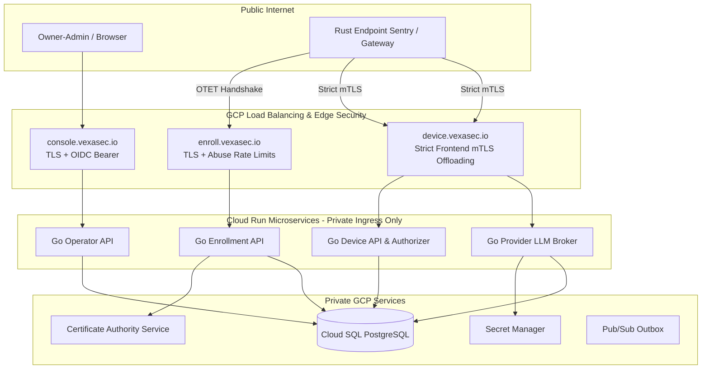

# Vexa Agent Control v4.0 System Architecture

**Target Domain:** `vexasec.io` (GCP SaaS Hub)  
**Contract Version:** 4.0  

---

## 1. System Topology & Network Boundaries



---

## 2. Cryptographic Core: Two-Key Enrollment

| Key Type | Algorithm | Storage | Purpose |
|---|---|---|---|
| **Identity Proof Key** | `Ed25519` | OS Secure Store (CNG/Keychain/0600) | Signs canonical transcript challenge during bootstrap and renewal proofs. |
| **mTLS Client Key** | `ECDSA P-256` | OS Secure Store | Embedded in PKCS#10 CSR to obtain GCP ALB-compatible mTLS client certificate. |

### Canonical Transcript Format:
```text
transaction_id|challenge_id|enroll.vexasec.io|tenant_id|ed25519_fingerprint|csr_sha256|2.0
```

---

## 3. Threat Model & Invariant Protections

* **Zero Fleet Secrets (NFR-SMB-003)**: Eliminates `GATEWAY_SECRET` and `POLICY_READ_SECRET`.
* **Atomic OTET Consumption (FR-SMB-001)**: Single-use guarantee enforced with PostgreSQL `SELECT ... FOR UPDATE`.
* **Immediate Revocation Containment (FR-SMB-009)**: Cloud SQL gate denies all device-facing routes on the next request.
* **Deterministic Fail-Closed Gateway (NFR-SMB-007)**: When policy is expired, invalid, or scanner fails, sensitive tool calls fail closed.
