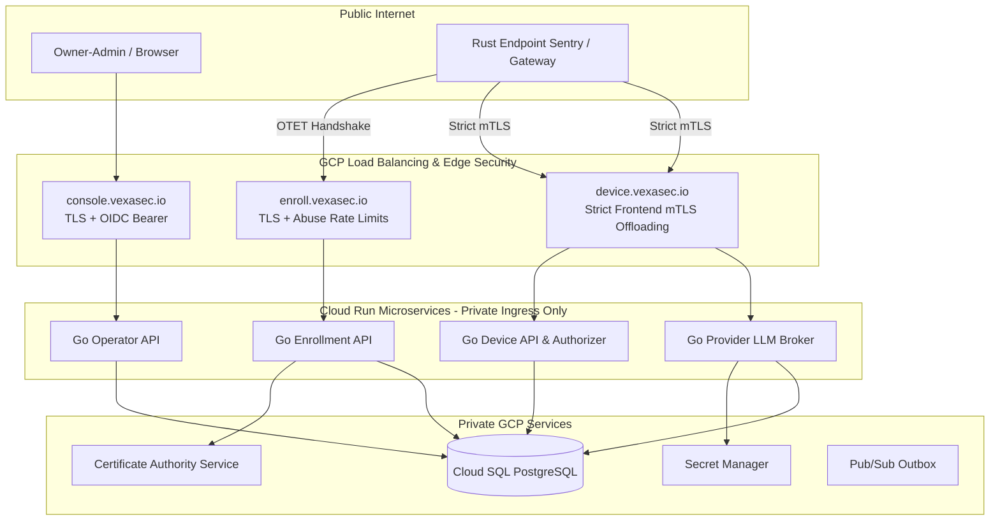

# Vexa Agent Control v4.0 System Architecture

**Target Domain:** `vexasec.io` (GCP SaaS Hub)  
**Contract Version:** 4.0  

---

## 1. System Topology & Network Boundaries



---

## 2. Cryptographic Core: Two-Key Enrollment

| Key Type | Algorithm | Storage | Purpose |
|---|---|---|---|
| **Identity Proof Key** | `Ed25519` | OS Secure Store (CNG/Keychain/0600) | Signs canonical transcript challenge during bootstrap and renewal proofs. |
| **mTLS Client Key** | `ECDSA P-256` | OS Secure Store | Embedded in PKCS#10 CSR to obtain GCP ALB-compatible mTLS client certificate. |

### Canonical Transcript Format:
```text
transaction_id|challenge_id|enroll.vexasec.io|tenant_id|ed25519_fingerprint|csr_sha256|2.0
```

---

## 3. Threat Model & Invariant Protections

* **Zero Fleet Secrets (NFR-SMB-003)**: Eliminates static plaintext shared keys in production by requiring mTLS and KMS-backed secret references.
* **Atomic OTET Consumption (FR-SMB-001)**: Single-use guarantee enforced with PostgreSQL `SELECT ... FOR UPDATE`.
* **Immediate Revocation Containment (FR-SMB-009)**: Cloud SQL gate denies all device-facing routes on the next request.
* **Deterministic Fail-Closed Gateway (NFR-SMB-007)**: When policy is expired, invalid, or spend preflight fails in enforce mode, sensitive egress calls fail closed.

---

## 4. Centralized LLM Key Custody & Brokered Egress

* **Encryption at Rest:** Provider API keys (OpenAI, Anthropic, Groq, Together, Mistral) are encrypted in the Hub database with AES-256-GCM using a 32-byte secret (`PROVIDER_KEY_ENCRYPTION_SECRET`).
* **Decryption Boundary:** Stored credentials are only decrypted in-memory inside the broker handler (`/api/v2/broker/llm-requests`) immediately before outbound provider dispatch.
* **Plaintext Isolation:** Raw keys are never distributed to endpoints, returned in UI payloads, or exposed in audit logs.

---

## 5. Spend Ledger Governance & Streaming Accounting

* **Integer Microcent Precision:** All currency calculations use exact integer microcents ($1.00 = 100,000,000 microcents) to eliminate floating-point drift.
* **Preflight Reservations:** The gateway reserves estimated input + maximum output tokens before contacting the model provider (`reserved + settled + new <= limit`).
* **SSE Stream Framing Parser:** Streaming responses (`stream: true`) are framed incrementally to capture real-time provider token counts (`usage` objects) or fall back to character estimation (`len / 4`), ensuring non-zero settlement upon stream completion.

---

## 6. Enterprise Identity Provider (IdP) Integration

* **Console SSO (Local Auth, Google Workspace, Microsoft Entra ID):**
  - **Local Auth:** In-database bcrypt password hashing and session tokens for air-gapped / standalone deployments.
  - **Google Workspace:** Standard OIDC discovery via `https://accounts.google.com/.well-known/openid-configuration` with optional hosted domain (`hd`) restrictions.
  - **Microsoft Entra ID:** OpenID Connect authorization code flow via `https://login.microsoftonline.com/{tenant}/v2.0` with optional group claim GUID mapping.
* **Workstation & Agent JWT Binding:**
  - Gateways validate incoming `Authorization: Bearer <JWT>` against cached IdP JWKS.
  - Resolved `identity_sub`, `identity_email`, and group memberships bind directly to spend reservations and audit events.

