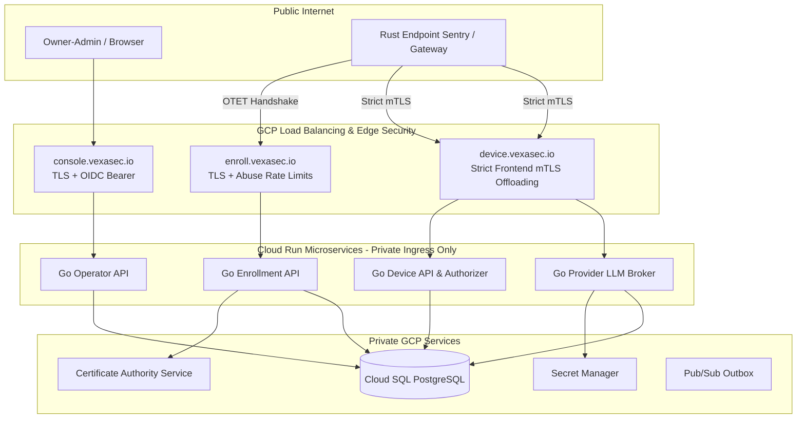

# Vexa Agent Control v4.0 System Architecture

**Target Domain:** `vexasec.io` (GCP SaaS Hub)  
**Contract Version:** 4.0  

---

## 1. System Topology & Network Boundaries



---

## 2. Cryptographic Core: Two-Key Enrollment

| Key Type | Algorithm | Storage | Purpose |
|---|---|---|---|
| **Identity Proof Key** | `Ed25519` | OS Secure Store (CNG/Keychain/0600) | Signs canonical transcript challenge during bootstrap and renewal proofs. |
| **mTLS Client Key** | `ECDSA P-256` | OS Secure Store | Embedded in PKCS#10 CSR to obtain GCP ALB-compatible mTLS client certificate. |

### Canonical Transcript Format:
```text
transaction_id|challenge_id|enroll.vexasec.io|tenant_id|ed25519_fingerprint|csr_sha256|2.0
```

---

## 3. Threat Model & Invariant Protections

* **Zero Fleet Secrets (NFR-SMB-003)**: Eliminates static plaintext shared keys in production by requiring mTLS and KMS-backed secret references.
* **Atomic OTET Consumption (FR-SMB-001)**: Single-use guarantee enforced with PostgreSQL `SELECT ... FOR UPDATE`.
* **Immediate Revocation Containment (FR-SMB-009)**: Cloud SQL gate denies all device-facing routes on the next request.
* **Deterministic Fail-Closed Gateway (NFR-SMB-007)**: When policy is expired, invalid, or spend preflight fails in enforce mode, sensitive egress calls fail closed.

---

## 4. Centralized LLM Key Custody & Brokered Egress

* **Encryption at Rest:** Provider API keys (OpenAI, Anthropic, Groq, Together, Mistral) are encrypted in the Hub database with AES-256-GCM using a 32-byte secret (`PROVIDER_KEY_ENCRYPTION_SECRET`).
* **Decryption Boundary:** Stored credentials are only decrypted in-memory inside the broker handler (`/api/v2/broker/llm-requests`) immediately before outbound provider dispatch.
* **Plaintext Isolation:** Raw keys are never distributed to endpoints, returned in UI payloads, or exposed in audit logs.

---

## 5. Spend Ledger Governance & Streaming Accounting

* **Integer Microcent Precision:** All currency calculations use exact integer microcents ($1.00 = 100,000,000 microcents) to eliminate floating-point drift.
* **Preflight Reservations:** The gateway reserves estimated input + maximum output tokens before contacting the model provider (`reserved + settled + new <= limit`).
* **SSE Stream Framing Parser:** Streaming responses (`stream: true`) are framed incrementally to capture real-time provider token counts (`usage` objects) or fall back to character estimation (`len / 4`), ensuring non-zero settlement upon stream completion.

---

## 6. Enterprise Identity Provider (IdP) Integration

* **Console SSO (Local Auth, Google Workspace, Microsoft Entra ID):**
  - **Local Auth:** In-database bcrypt password hashing and session tokens for air-gapped / standalone deployments.
  - **Google Workspace:** Standard OIDC discovery via `https://accounts.google.com/.well-known/openid-configuration` with optional hosted domain (`hd`) restrictions.
  - **Microsoft Entra ID:** OpenID Connect authorization code flow via `https://login.microsoftonline.com/{tenant}/v2.0` with optional group claim GUID mapping.
* **Workstation & Agent JWT Binding:**
  - Gateways validate incoming `Authorization: Bearer <JWT>` against cached IdP JWKS.
  - Resolved `identity_sub`, `identity_email`, and group memberships bind directly to spend reservations and audit events.

---

## 7. Phase-Oriented Execution Pipeline

All incoming agent requests (MCP tool calls, LLM chat completions, embeddings) execute through a strict, deterministic 9-stage pipeline:

```text
Ingress -> Identity Binding -> Snapshot Acquisition -> Security Inspection (DLP/Inj/SafeMode) -> Preflight Reservation -> Route Planning -> Upstream Execution -> Stream Sanitization -> Settlement & Outbox
```

1. **Immutable Snapshot Swaps:** Policies, deployment routes, and price tables are held in atomic `ConfigSnapshotStore` wrappers, guaranteeing zero lock contention on hot paths.
2. **Operation Classification & Replay Taxonomy:** Operations are partitioned into `ReadOnly` (LLM completions, embeddings) and `SideEffecting` (MCP file writes, shell execution, database mutations). Side-effecting operations are **never** blindly replayed.

---

## 8. Bidirectional Provider Transformation Engine

Standardizes incoming OpenAI-formatted chat requests across heterogeneous upstream model providers:
* **OpenAI:** Native `/v1/chat/completions` pass-through with header sanitization.
* **Azure OpenAI:** Dynamic deployment name URL rewriting and `api-key` header adaptation.
* **Groq:** Ultra-low latency LPU routing via `https://api.groq.com/openai/v1/chat/completions`.
* **Anthropic:** Transforms OpenAI messages and tool calls into Anthropic `/v1/messages` format, extracting top-level system prompts and translating streaming delta chunks.
* **Google Gemini:** Adapts requests to Gemini OpenAI-compatible endpoints with API key headers.
* **AWS Bedrock:** Formats requests for Bedrock `Converse` APIs with SigV4 authentication.

---

## 9. Valkey Distributed State Layer

* **Open-Source BSD Engine:** Uses Valkey (wire-compatible with RESP2/RESP3) for sub-millisecond Virtual Key caching, distributed token buckets (RPM/TPM), and atomic microcent spend reservations.
* **Zero-Lock Database Architecture:** PostgreSQL row-level locking is replaced by Valkey-backed atomic `ReserveSpend` with asynchronous background batch settlements every 5 seconds.
* **Serverless Cost Optimization:** Containerized Valkey runs alongside the Control Plane on AWS (ECS Fargate Spot), Azure (Container Apps), and GCP (Cloud Run) with minimal resource footprint ($0 to <$15/mo).

---

## 10. Decoupled Durable Event Outbox

* **Tamper-Evident Durability:** The local HMAC-SHA256 audit logger commits each entry to local disk via `sync_all()` before confirming the request.
* **Non-Blocking Asynchronous Fan-Out:** Network SIEM exports (Splunk, Datadog, OpenSearch) and Control Hub telemetry are dispatched via `DurableOutbox` worker tasks, preventing remote network latencies from stalling the gateway.

---

## 11. Pluggable Routing Engine & Data Residency (AR-2)

The gateway features a pluggable routing layer supporting diverse multi-model selection strategies per model group:
* **`PriorityStrategy`:** Primary/secondary fallback sequence honoring explicit deployment priority ordinals.
* **`LowestLatencyStrategy`:** Evaluates exponential moving average (EMA) response latency metrics reported by `StatsProvider` to route to the fastest available deployment.
* **`WeightedRandomStrategy`:** Proportional distribution based on deployment traffic weights for canary and load distribution scenarios.
* **`RegionAffinityStrategy`:** Strict data residency compliance. If the chosen deployment region violates `allowed_regions`, the engine deterministically fails closed with HTTP 503 `routing_policy_violation` rather than silently leaking data across borders.

---

## 12. Extensible Pipeline Hook Lifecycle Framework (AR-1)

A unified hook system provides lifecycle interception across three distinct stages:
* **`PreRoute`:** Intercepts raw HTTP requests before routing decisions or payload parsing. Supports header injection and raw byte mutations (`ModifyBytes`).
* **`PreExecute`:** Intercepts structured MCP tool calls (`serde_json::Value`), executing content sanitizers, inline DLP redactions (`ModifyJson`), and security blocks (`Block`).
* **`PostExecute`:** Intercepts outbound downstream responses and streaming token chunks (`ModifyBytes`).
* **Unified Scanner Construction:** Detectors (DLP, Prompt Injection, Safe Mode) are compiled once at gateway startup inside `ProxyState` and shared cleanly across pipeline hooks and request handlers.

---

## 13. Decomposed Control Plane & Asynchronous Batch Durability (AR-3, AR-4, AR-5)

The Go Control Plane separates monolithic spend database operations into specialized, high-throughput components:
* **`runs.Store`:** Decoupled execution history and forensic run dossiers (`ListRuns`, `GetRunDossier`), preventing analytical queries from interfering with transaction hot paths.
* **`SpendEventWriter`:** Asynchronous bounded queue with batch ingestion via `pgx.Batch`. Incorporates a 2-second backpressure timeout to drop-and-alert instead of exhausting memory or stalling proxies, with clean shutdown drain guarantees.
* **Centralized `Scheduler`:** Deterministic background daemon managing periodic tasks (e.g. `SweepJob` for expired reservation holds) with graceful cancellation context and live introspection endpoint at `/internal/jobs`.


