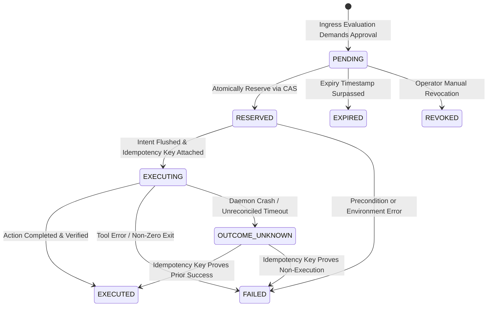

# ADR-010: Human-in-the-Loop (HITL) State Machine, Idempotent Crash Recovery, and Local API Threat Boundaries

**Status:** APPROVED (Phase 0a Baseline)  
**Date:** 2026-10-04  
**Author:** Architecture Team  
**Governing Standard:** Architecture & Security Hardening Standard

---

## 1. Context & Technical Diagnosis

### 1.1 The Side-Effect Crash Failure Window
Earlier designs used a boolean flag or a single server-side compare-and-set (CAS) to consume approval tokens. While CAS prevents simple token replay, it fails during crashes:
1. Approval token is consumed via CAS.
2. The external tool execution begins (e.g. destructive shell command, cloud resource termination, database migration).
3. The gateway process, agent, or host crashes before the tool result is committed to the audit log.
4. On restart, the token is consumed. The agent or developer retries the action, but because the token is dead and the prior tool outcome is unknown, the system either:
   - Silently re-executes a dangerous non-idempotent side effect (risking duplicate payments, duplicate deletions), or
   - Blocks the action with no diagnostic feedback, leaving the system in an inconsistent state.

### 1.2 Approval Secret Leakage
In [`policy/hitl.rs` L264-L287](../../src/policy/hitl.rs#L264-L287), headless and notification fallbacks printed signed approval URLs containing cryptographic HMAC secrets to `stderr` and desktop notification text (`notify-send`). Any unprivileged local process reading process output or desktop notification history could capture and replay the approval before the user acted.

---

## 2. Decision: Part A — The Formal 6-State HITL Lifecycle

Approval state transitions are governed by an explicit state machine tracked in persistent WAL storage:



### 2.1 State Definitions & Lifecycle Rules:
1. **`PENDING`**: Request generated. Holds cryptographic nonce, expiry timestamp, canonical action fingerprint, and opaque reference ID (`appr-<uuid>`).
2. **`RESERVED`**: Atomically acquired by execution engine via CAS. Generates a unique **idempotency key** (`idem-<uuid>`).
3. **`EXECUTING`**: Write-ahead record flushed to disk immediately *before* dispatching the tool call or external API request.
4. **`EXECUTED`**: Tool finished with verified success. Outcome logged to audit log.
5. **`FAILED`**: Tool invocation rejected or terminated with error.
6. **`EXPIRED`**: Token time-to-live elapsed before reservation.
7. **`REVOKED`**: Explicit cancellation by security lead or developer.

### 2.2 Crash Recovery Protocol & `OUTCOME_UNKNOWN`:
- Upon daemon restart, any records found in `EXECUTING` or `RESERVED` trigger reconciliation.
- The daemon checks the tool provider's status using the assigned `idempotency_key`.
- If the tool provider cannot confirm execution (e.g. arbitrary bash script), the record transitions to **`OUTCOME_UNKNOWN`**.
- **Invariant**: **Vexa will NEVER silently re-execute an uncertain side effect.** The system flags `OUTCOME_UNKNOWN` in the trace explorer and requires human operator confirmation.

### 2.3 Secret Isolation & Opaque References:
- Desktop notifications and `stderr` output emit **only** an unprivileged opaque reference ID:
  ```
  [Agent Control HITL] Approval Required: Tool 'write_file' requested by agent.
  Approval Reference ID: appr-8f3a91-4b2c
  Approve via Local Dashboard: http://127.0.0.1:18080/dashboard
  ```
- No HMAC signatures, tokens, or executable URLs are ever placed in `stderr`, notification text, or unencrypted logs.
- Approving an action requires submitting an authenticated session capability over loopback (`POST /api/v1/hitl/respond`).

### 2.4 Scope Invariant: Strict `ALLOW_N`
- `ALLOW_N` approval scopes are bound strictly to:
  $$\text{Scope} = (\text{tool\_name}, \text{arguments\_hash}, \text{workspace\_id}, \text{audience})$$
- Wildcards (`*`) and regex path broadening are prohibited in v1.

---

## 3. Decision: Part B — Local API Security Architecture & Threat Boundaries

### 3.1 Explicit Threat Boundary Disclosure

> **Architectural Boundary Statement:**  
> Vexa Agent Control is an out-of-process sentry designed to protect developers from rogue, compromised, or runaway AI agents, prompt injection exploits, credential leaks, and network-origin attacks (CSRF, DNS rebinding).  
> **Boundary Limitation:** Vexa does **NOT** defend against an active, malicious process running under the **same local OS user account**. An adversary with local user execution privileges can inspect user memory, terminate user processes, or read user-owned credentials unless isolated by host-level OS sandboxes (e.g. Windows AppContainer, Linux cgroups/SELinux).

### 3.2 Scoped Capability Tokens

All communication with the local HTTP/SSE API (`127.0.0.1:18080`) requires Bearer authentication with explicit capability scopes:

| Scope | Permitted Endpoints | Description |
|---|---|---|
| `Scope::TraceRead` | `GET /api/v1/traces`, `GET /api/v1/stats` | Access to operational telemetry with **redacted** payloads. |
| `Scope::RawPayloadRead` | `GET /api/v1/traces/{id}/raw` | Decrypts and views unmasked prompts/completions; **emits audit event**. |
| `Scope::ApprovalWrite` | `POST /api/v1/hitl/respond` | Authorizes or rejects pending HITL requests. |
| `Scope::AdminWrite` | `POST /api/v1/policy/reload`, `/api/v1/cache/clear` | Reloads policies, rotates tokens, clears cache. |

### 3.3 CSRF, Origin & DNS Rebinding Defenses
- **CSRF**: All mutation endpoints reject requests containing `Sec-Fetch-Site: cross-site` with HTTP 403 Forbidden.
- **Origin Validation**: Strict allowlist: `http://127.0.0.1:*`, `http://localhost:*`.
- **DNS Rebinding**: Host header validation rejects any request where `Host` is not `127.0.0.1`, `localhost`, or `::1`.
- **Multi-User Isolation**: Default installation operates per-user. Multiple users on a single machine cannot share credentials or socket files; each user must execute their own isolated daemon instance.
