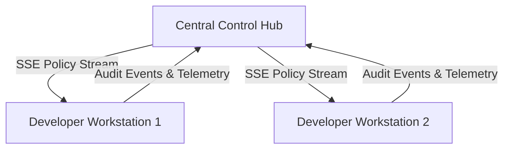

# Team Operations & Device Fleet Management

This guide covers managing developer workstation fleets, device onboarding via One-Time Enrollment Tokens (OTET), telemetry streaming, and spend controls.

---

## Architecture Overview



---

## 1. Workstation Fleet Onboarding (OTET)

The One-Time Enrollment Token (OTET) securely binds a developer workstation to your team workspace:

1. **Generate OTET via API or UI:**
   ```bash
   curl -X POST http://<HUB_HOST>:8081/api/v1/enrollment/tokens \
     -H "Authorization: Bearer <ADMIN_TOKEN>" \
     -H "Content-Type: application/json" \
     -d '{"user_email": "dev@company.com", "expires_in_hours": 24}'
   ```

2. **Enroll Workstation:**
   The developer runs:
   ```bash
   agentcontrol enroll --token <OTET_TOKEN> --hub-url http://<HUB_HOST>:8081
   ```

3. **Cryptographic Binding:**
   The workstation generates an Ed25519 keypair in `~/.agentcontrol/keys/` and submits the public key to the Hub. All subsequent telemetry and heartbeats are cryptographically signed.

---

## 2. Spend Caps & Token Budgets

Set spend limits to prevent runaway loops or budget exhaustion:

- **Per-Developer Monthly Budget:** `$150.00`
- **Per-Request Soft Cap:** `$0.50` (prompts confirmation)
- **Per-Request Hard Cap:** `$2.00` (denies execution)
