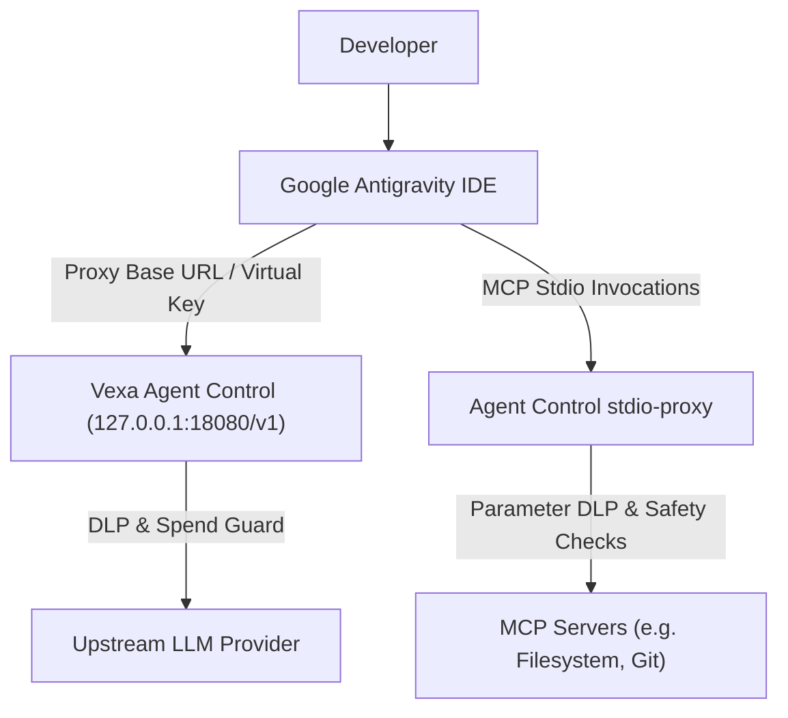

# Google Antigravity IDE Integration Guide

This guide details how **Vexa Agent Control** connects to and governs **Google Antigravity IDE** on developer workstations using LiteLLM-style virtual key injection and zero-trust MCP proxy interception.

---

## Architecture & Unified Governance

Google Antigravity IDE uses a centralized JSON configuration (`.gemini/config/mcp_config.json` or `AppData\Roaming\Antigravity\mcp.json`) to define custom model endpoints, proxy endpoints, and Model Context Protocol (MCP) server extensions.



---

## Connecting Antigravity IDE

To connect Antigravity IDE to Vexa Agent Control:

```bash
# Auto-detect mode (uses Control Hub key if enrolled, or local proxy token):
agentcontrol connect antigravity

# Explicit virtual key:
agentcontrol connect antigravity --key sk-vex-antigravity-key-12345

# Explicit local mode:
agentcontrol connect antigravity --mode local
```

### Configuration Locations (OS-aware):
- **macOS / Linux:** `~/.gemini/config/mcp_config.json` (or `~/.config/antigravity/mcp.json`)
- **Windows:** `%USERPROFILE%\.gemini\config\mcp_config.json` (or `%APPDATA%\Antigravity\mcp.json`)

### What Happens During Connect:

1. **Proxy Endpoint & Key Injection:**
   Injects `proxy_url`, `api_key`, `antigravity.proxy.baseUrl`, and `antigravity.proxy.apiKey` pointing to `http://127.0.0.1:18080/v1`.
2. **MCP Tool Wrapping:**
   Each server defined under `mcpServers` is wrapped with `agentcontrol stdio-proxy -- <command>`.
3. **Ownership Manifest:**
   Records all injected keys and previous values in `~/.agentcontrol/manifests/antigravity.manifest.json`.

```json
{
  "proxy_url": "http://127.0.0.1:18080/v1",
  "api_key": "sk-vex-antigravity-key-12345",
  "antigravity.proxy.baseUrl": "http://127.0.0.1:18080/v1",
  "antigravity.proxy.apiKey": "sk-vex-antigravity-key-12345",
  "mcpServers": {
    "calculator": {
      "command": "agentcontrol",
      "args": ["stdio-proxy", "--", "python", "calc.py"]
    }
  }
}
```

---

## Output Summary

Upon connecting, a standardized summary table is printed:

```text
✔ Successfully connected Antigravity IDE!
  ✔ Configuration:     C:\Users\wasim\.gemini\config\mcp_config.json
  ✔ LLM Endpoint:      http://127.0.0.1:18080/v1
  ✔ Auth Token:        sk-vex...2345 (Virtual Key from Control Hub)
  ✔ MCP Servers:       1 wrapped with stdio-proxy
  ✔ Mode:              cloud-direct

  ℹ Restart Antigravity IDE to apply changes.
```

---

## Disconnecting Antigravity IDE

To cleanly revert Antigravity IDE to its original unmanaged state:

```bash
agentcontrol disconnect antigravity
```

- Reverts `proxy_url`, `api_key`, `antigravity.proxy.baseUrl`, and `antigravity.proxy.apiKey`.
- Unwraps all MCP servers in `mcpServers` back to original executables and arguments.
- Preserves all custom user settings, custom skills, and rules untouched.

---

## Verification

```bash
agentcontrol doctor
agentcontrol status
```
Output will report Antigravity IDE as `CONNECTED` and `MCP_WRAPPED` (with freshness tier `ACTIVE_FRESH`).
