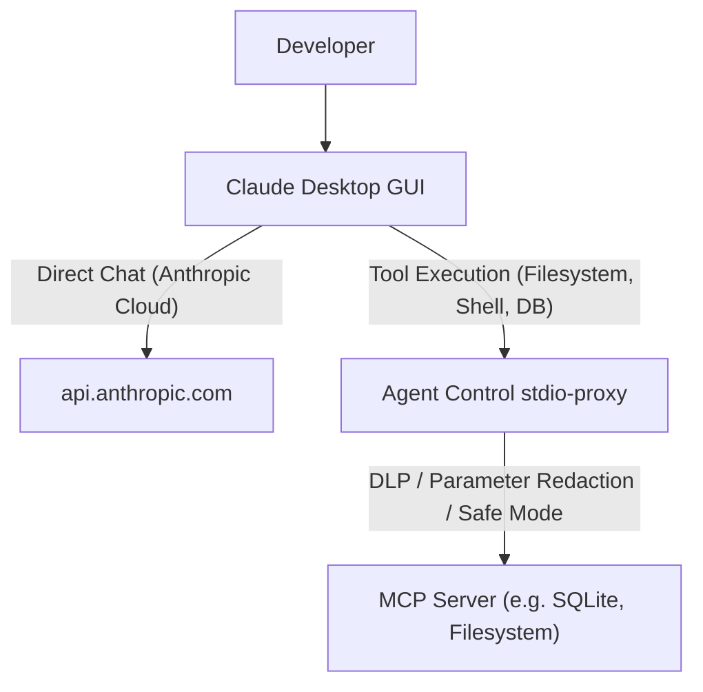

# Anthropic Claude Desktop Integration Guide

This guide details how **Vexa Agent Control** connects to and governs **Claude Desktop** on developer workstations using LiteLLM-style virtual key injection and zero-trust MCP proxy interception.

---

## Architecture & Dual Governance Boundaries

Because Anthropic's Claude ecosystem includes both the **Claude Desktop GUI** application and the **Claude Code CLI**, Vexa Agent Control applies the appropriate zero-trust governance boundary for each:

### 1. Claude Desktop (GUI) — MCP Tool Execution Boundary
Claude Desktop's graphical client routes chat completions directly via HTTPS to Anthropic's cloud. Its configuration file (`claude_desktop_config.json`) strictly governs **Model Context Protocol (MCP) servers**. 

Vexa Agent Control intercepts all local system actions, file modifications, and database queries at the **MCP Tool Execution Boundary** by wrapping each tool server with `agentcontrol stdio-proxy`:



### 2. Claude Code (CLI) & Anthropic SDKs — Full LLM Proxy Boundary
For terminal-based workflows (Claude Code CLI) or applications using `@anthropic-ai/sdk` / `anthropic` Python SDK, full LLM completions and virtual key spend governance are routed directly through the gateway:

```bash
export ANTHROPIC_BASE_URL="http://127.0.0.1:18080"
export ANTHROPIC_API_KEY="sk-vex-your-virtual-key"
```

---

## Industry Comparison: How LiteLLM & Vexa Manage Claude Desktop

| Feature / Dimension | 🛡️ Vexa Agent Control | 🌐 LiteLLM Proxy |
| :--- | :--- | :--- |
| **Claude Desktop GUI Support** | **Automatic 1-Click MCP Tool Wrapping** (`agentcontrol connect claude`) | MCP Tool Server (`python -m litellm.mcp`) or manual proxy setup |
| **Config Schema Safety** | Preserves strict Zod schema in `claude_desktop_config.json`; avoids unsupported keys that get wiped | N/A (Manual user config) |
| **Tool Parameter DLP** | 21-pattern inline DLP, credential redaction, and SafeMode file traversal defense | Basic prompt logging |
| **Process Sandboxing** | Multi-OS Stdio process RSS memory caps (<64MB) and crash isolation | Standard Python subprocess |
| **Claude Code CLI Routing** | Native `/v1/messages` and `/v1/chat/completions` translation | `/v1/messages` translation |
| **Reversibility** | 1-Command non-destructive revert via `agentcontrol disconnect claude` | Manual file edits |

---

## Connecting Claude Desktop

To connect Claude Desktop to Vexa Agent Control:

```bash
# Auto-detect mode (wraps all configured MCP servers):
agentcontrol connect claude

# Explicit local mode:
agentcontrol connect claude --mode local
```

### Configuration Locations:
- **macOS:** `~/Library/Application Support/Claude/claude_desktop_config.json`
- **Windows:** `%APPDATA%\Claude\claude_desktop_config.json` *(or Windows Store package cache)*
- **Linux:** `~/.config/Claude/claude_desktop_config.json`

### What Happens During Connect:

1. **MCP Tool Server Wrapping:**
   Each server entry in `mcpServers` is safely wrapped with `agentcontrol stdio-proxy --`:
   ```json
   {
     "mcpServers": {
       "filesystem": {
         "command": "agentcontrol",
         "args": [
           "stdio-proxy",
           "--",
           "npx",
           "-y",
           "@modelcontextprotocol/server-filesystem",
           "C:\\workspace"
         ]
       }
     }
   }
   ```
2. **Schema Integrity:**
   Avoids injecting unsupported top-level keys (`apiUrl`, `apiKey`) that Claude Desktop's parser strips on boot.
3. **Ownership Manifest:**
   An `OwnershipManifest` is recorded at `~/.agentcontrol/manifests/claude.manifest.json` for risk-free reversal.

---

## Standard Output Summary

```text
✔ Successfully connected Claude Desktop!
  ✔ Configuration:     C:\Users\wasim\AppData\Roaming\Claude\claude_desktop_config.json
  ℹ Governance:        MCP Tool Boundary (Claude Desktop routes chat to api.anthropic.com)
  ✔ MCP Servers:       1 wrapped with stdio-proxy
  ✔ Mode:              local

  ℹ Restart Claude Desktop to apply changes.
```

---

## Governing Claude Code (CLI)

For command-line Claude Code users who want full LLM completion proxying, rate limiting, DLP, and budget governance:

```bash
# Connect Claude Code CLI (injects into ~/.claude/settings.json):
agentcontrol connect claude-code

# With explicit virtual key in cloud-direct mode:
agentcontrol connect claude-code --key sk-vex-your-virtual-key
```

### Disconnecting Claude Code

```bash
agentcontrol disconnect claude-code
```

---

## Disconnecting Claude Desktop

To cleanly revert Claude Desktop to its unmanaged state:

```bash
agentcontrol disconnect claude
```

- Unwraps all MCP servers in `mcpServers` back to their original commands and arguments.
- Any other settings in `claude_desktop_config.json` (such as custom preferences, themes, or additional tools) are preserved completely.

---

## Verification

```bash
agentcontrol doctor
agentcontrol status
```
Output will report Claude Desktop as `CONNECTED` and `MCP_WRAPPED` (with freshness tier `ACTIVE_FRESH`).
