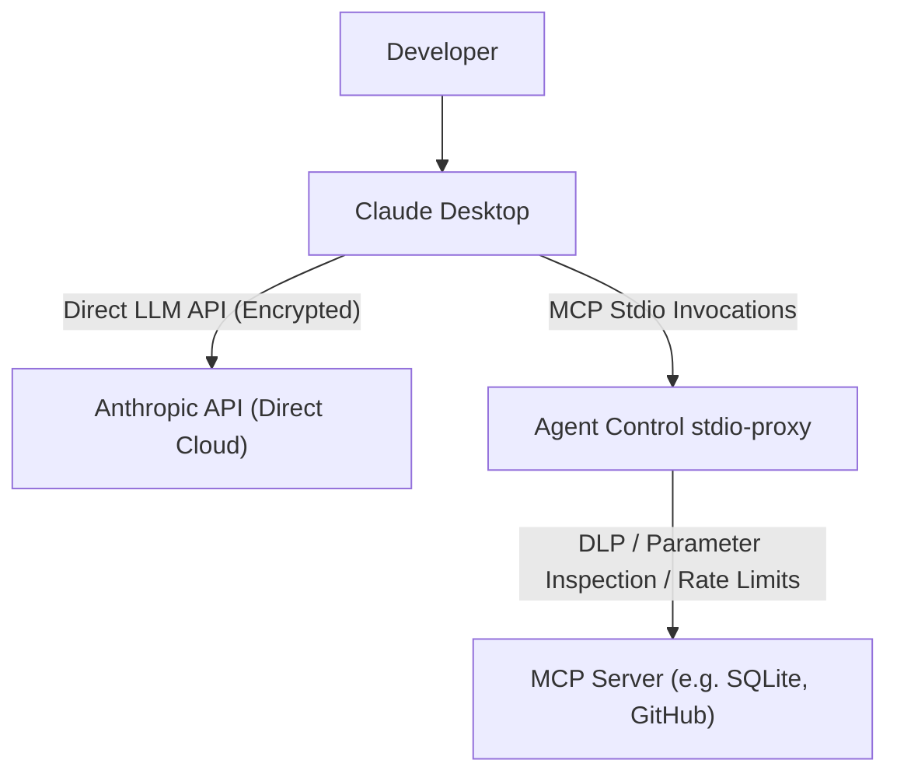

# Anthropic Claude Desktop Integration Guide

This guide details how **Vexa Agent Control** connects to and governs **Claude Desktop** on developer workstations.

---

## Architecture & Boundary

Claude Desktop communicates directly with Anthropic's cloud endpoints over HTTPS using proprietary, pinned certificates and endpoints.
However, all local extensions and third-party integrations run through the **Model Context Protocol (MCP)**.



> [!NOTE]
> **Protocol Disclosure: Claude Desktop Direct LLM Routing**
> Claude Desktop's direct model completions do not support custom base URL configuration without modifying application binaries.
> Vexa Agent Control governs Claude Desktop at the **MCP Tool Boundary** via `stdio-proxy`. All MCP tool executions, database queries, and filesystem accesses are fully governed and logged to the central HMAC audit trail.

---

## Connecting Claude Desktop

To connect Claude Desktop to Vexa Agent Control:

```bash
agentcontrol connect claude
```

### Configuration Location:
- **macOS:** `~/Library/Application Support/Claude/claude_desktop_config.json`
- **Windows:** `%APPDATA%\Claude\claude_desktop_config.json`
- **Linux:** `~/.config/Claude/claude_desktop_config.json`

### What Happens During Connect:

1. **Backup Creation:**
   A baseline backup is created in `~/.agentcontrol/backups/claude.config.<timestamp>.bak`.

2. **MCP Wrapping:**
   Each server entry in `mcpServers` is wrapped with `agentcontrol stdio-proxy --`:
   ```json
   {
     "mcpServers": {
       "postgres": {
         "command": "agentcontrol",
         "args": [
           "stdio-proxy",
           "--",
           "npx",
           "-y",
           "@modelcontextprotocol/server-postgres",
           "postgresql://localhost/mydb"
         ]
       }
     }
   }
   ```

3. **Ownership Manifest:**
   An `OwnershipManifest` is recorded at `~/.agentcontrol/manifests/claude.manifest.json`.

---

## Disconnecting Claude Desktop

To cleanly revert Claude Desktop to its unmanaged state:

```bash
agentcontrol disconnect claude
```

- Every server entry in `mcpServers` has the `agentcontrol stdio-proxy --` prefix stripped, restoring the original executable and argument list.
- Any other settings in `claude_desktop_config.json` (such as global themes, font sizes, or additional tools added after connection) are preserved completely.

---

## Verification

```bash
agentcontrol status
```
Output will report Claude Desktop as `MCP_WRAPPED` (with freshness tier `ACTIVE_FRESH`).
