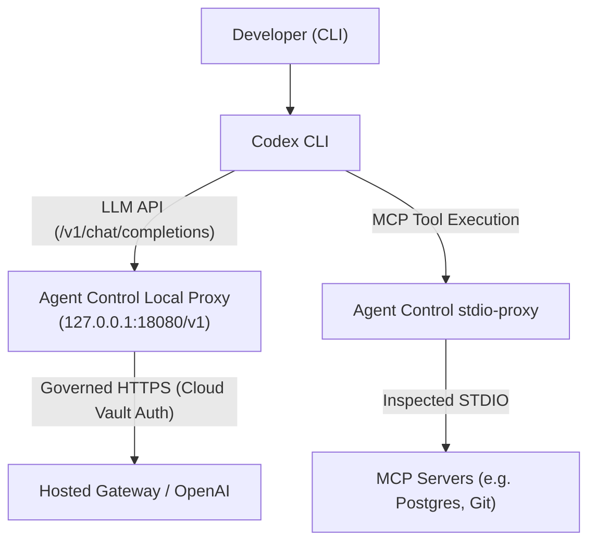

# OpenAI Codex Integration Guide

This guide details how **Vexa Agent Control** connects to and governs the **OpenAI Codex CLI** on developer workstations using LiteLLM-style virtual key injection and zero-trust MCP proxy interception.

---

## Architecture & Boundary

Codex connects to OpenAI models via an HTTP API and executes developer tools either natively or via Model Context Protocol (MCP) servers.



---

## Connecting Codex

To connect Codex to Vexa Agent Control:

```bash
# Auto-detect mode:
agentcontrol connect codex

# Explicit virtual key:
agentcontrol connect codex --key sk-vex-codex-key-12345

# Force local mode:
agentcontrol connect codex --mode local
```

### Configuration Locations (OS-aware):
- **macOS / Linux:** `~/.codex/config.toml` and `~/.codex/auth.json`
- **Windows:** `%USERPROFILE%\.codex\config.toml` and `%USERPROFILE%\.codex\auth.json`

### What Happens During Connect:

1. **Path Discovery & Backup:**
   Agent Control locates your user Codex configuration file at `~/.codex/config.toml` and creates a baseline backup.

2. **Configuration Injection:**
   Agent Control updates `~/.codex/config.toml` and synchronizes `~/.codex/auth.json`:
   ```toml
   openai_base_url = "http://127.0.0.1:18080/v1"

   [shell_environment_policy]
   inherit = "core"

   [shell_environment_policy.set]
   OPENAI_BASE_URL = "http://127.0.0.1:18080/v1"
   OPENAI_API_KEY = "sk-vex-codex-key-12345"
   ```

3. **MCP Server Wrapping:**
   If `[mcp_servers]` are configured in `config.toml`, their execution command is wrapped:
   ```toml
   [mcp_servers.database]
   command = "agentcontrol"
   args = ["stdio-proxy", "--", "node", "db-server.js"]
   ```

4. **Ownership Manifest:**
   An ownership manifest is written to `~/.agentcontrol/manifests/codex.manifest.json`.

---

## Standard Output Summary

```text
✔ Successfully connected OpenAI Codex CLI!
  ✔ Configuration:     C:\Users\wasim\.codex\config.toml
  ✔ LLM Endpoint:      http://127.0.0.1:18080/v1
  ✔ Auth Token:        sk-vex...2345 (Virtual Key from Control Hub)
  ✔ MCP Servers:       1 wrapped with stdio-proxy
  ✔ Mode:              cloud-direct

  ℹ Restart OpenAI Codex CLI to apply changes.
```

---

## Disconnecting Codex

To cleanly disconnect Codex:

```bash
agentcontrol disconnect codex
```

- Agent Control removes the `OPENAI_BASE_URL` and `OPENAI_API_KEY` overrides from `[shell_environment_policy.set]` and `openai_base_url`.
- All wrapped MCP servers in `[mcp_servers]` are restored to their original commands and arguments.
- Any user modifications (e.g. custom tool configurations, model parameters, theme settings) made while connected are **preserved intact**.

---

## Verifying Codex Connection

```bash
agentcontrol status
agentcontrol doctor
```
