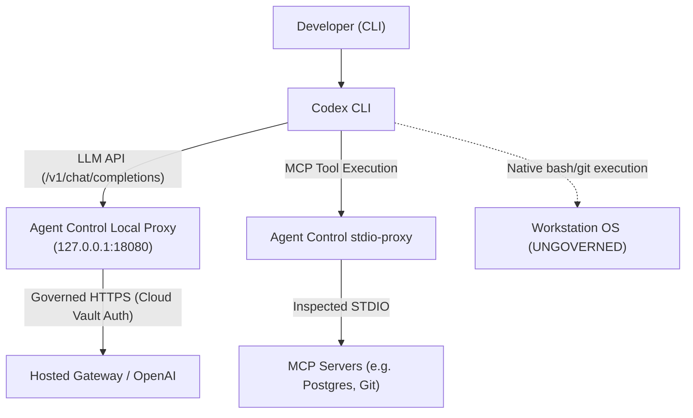

# OpenAI Codex Integration Guide

This guide details how **Vexa Agent Control** connects to and governs the **OpenAI Codex CLI** on developer workstations.

---

## Architecture & Boundary

Codex connects to OpenAI models via an HTTP API and executes developer tools either natively or via Model Context Protocol (MCP) servers.



> [!WARNING]
> **Protocol Disclosure: Native Shell Execution**
> Codex supports direct execution of native shell commands (`bash`, `sh`, `cmd`, `powershell`) and local `git` operations outside of MCP.
> These direct shell invocations do not transit the HTTP proxy or MCP stdio proxy and are **ungoverned**. For full workstation isolation, configure enterprise endpoint policies.

---

## Connecting Codex

To connect Codex to Vexa Agent Control:

```bash
agentcontrol connect codex
```

### What Happens During Connect:

1. **Path Discovery:**
   Agent Control locates your user Codex configuration file at `~/.codex/config.toml` (or `%USERPROFILE%\.codex\config.toml` on Windows).

2. **Baseline Backup:**
   A timestamped backup is saved to `~/.agentcontrol/backups/codex.config.toml.<timestamp>.bak`.
   If `.agentcontrol.baseline.bak` does not exist, an immutable baseline copy is created.

3. **Configuration Injection:**
   Agent Control updates `~/.codex/config.toml`:
   ```toml
   [shell_environment_policy.set]
   OPENAI_BASE_URL = "http://127.0.0.1:18080/v1"
   OPENAI_API_KEY = "local-proxy-session-token"
   ```

4. **MCP Server Wrapping:**
   If `[mcp_servers]` are configured in `config.toml`, their execution command is wrapped:
   ```toml
   [mcp_servers.database]
   command = "agentcontrol"
   args = ["stdio-proxy", "--", "node", "db-server.js"]
   ```

5. **Ownership Manifest:**
   An ownership manifest is written to `~/.agentcontrol/manifests/codex.manifest.json`.

---

## Disconnecting Codex

To cleanly disconnect Codex:

```bash
agentcontrol disconnect codex
```

- Agent Control removes the `OPENAI_BASE_URL` and `OPENAI_API_KEY` overrides from `[shell_environment_policy.set]`.
- All wrapped MCP servers in `[mcp_servers]` are restored to their original commands and arguments.
- Any user modifications (e.g. custom tool configurations, model parameters, theme settings) made while connected are **preserved intact**.

---

## Verifying Codex Connection

Check connection health:

```bash
agentcontrol status
agentcontrol doctor
```
