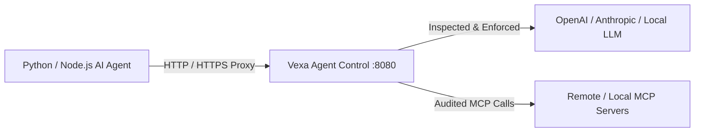

# Custom Agent HTTP Proxy Guide

This guide explains how to route custom AI agents (LangChain, LlamaIndex, CrewAI, AutoGen, or raw HTTP/REST scripts) through Vexa Agent Control.

---

## Architecture Overview



---

## 1. Environment Variable Setup

The simplest way to route outbound agent traffic through Vexa is via standard HTTP proxy environment variables:

### Linux / macOS (Bash / Zsh)
```bash
export AGENTCONTROL_PROXY_URL="http://127.0.0.1:8080"
export HTTP_PROXY="http://127.0.0.1:8080"
export HTTPS_PROXY="http://127.0.0.1:8080"
```

### Windows (PowerShell)
```powershell
$env:AGENTCONTROL_PROXY_URL = "http://127.0.0.1:8080"
$env:HTTP_PROXY = "http://127.0.0.1:8080"
$env:HTTPS_PROXY = "http://127.0.0.1:8080"
```

### Windows (Command Prompt - CMD)
```cmd
set AGENTCONTROL_PROXY_URL=http://127.0.0.1:8080
set HTTP_PROXY=http://127.0.0.1:8080
set HTTPS_PROXY=http://127.0.0.1:8080
```

> [!TIP]
> If Vexa Agent Control is running in Docker, the proxy port `8080` is accessible via the exact same localhost URLs across Linux, macOS, and Windows.

---

## 2. Python Framework Examples

### LangChain / OpenAI SDK
```python
import os
from openai import OpenAI

# The OpenAI client automatically respects HTTP_PROXY / HTTPS_PROXY
client = OpenAI(
    api_key=os.environ.get("OPENAI_API_KEY"),
)

response = client.chat.completions.create(
    model="gpt-4o",
    messages=[{"role": "user", "content": "Hello, world!"}]
)
print(response.choices[0].message.content)
```

### Direct MCP Gateway Proxy
If your agent communicates with MCP servers over HTTP JSON-RPC:
```python
import requests

payload = {
    "jsonrpc": "2.0",
    "id": 1,
    "method": "tools/call",
    "params": {
        "name": "read_file",
        "arguments": {"path": "README.md"}
    }
}

# Send directly through the Vexa gateway endpoint
response = requests.post("http://127.0.0.1:8080/v1/mcp", json=payload)
print(response.json())
```

---

## 3. TypeScript / Node.js Framework Examples

### Node.js with Undici / Fetch
```typescript
import { fetch, setGlobalDispatcher, ProxyAgent } from 'undici';

const proxyUrl = process.env.AGENTCONTROL_PROXY_URL || 'http://127.0.0.1:8080';
const proxyAgent = new ProxyAgent(proxyUrl);
setGlobalDispatcher(proxyAgent);

async function run() {
  const res = await fetch('https://api.openai.com/v1/models', {
    headers: { 'Authorization': `Bearer ${process.env.OPENAI_API_KEY}` }
  });
  const data = await res.json();
  console.log(data);
}

run();
```

---

## 4. Verifying Custom Agent Traffic

1. Start the gateway: `agentcontrol protect --shadow`
2. Run your agent script in the configured shell.
3. Open `http://127.0.0.1:8080` to observe your agent's outbound calls and tool usage in real time.
