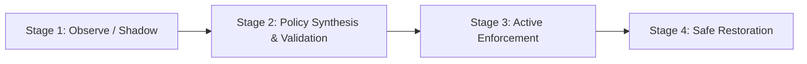

# Workstation Developer Workflow Guide

This guide walks you through the recommended 4-stage workstation security lifecycle: **Observe (Shadow Mode) &rarr; Validate &rarr; Enforce &rarr; Restore**.

---

## The 4-Stage Lifecycle



---

## Stage 1: Observe (Shadow Mode)

In **Shadow Mode**, Vexa records every tool call, parameter, response, and theoretical policy verdict into `~/.agentcontrol/audit.jsonl` **without blocking any traffic**. This allows developers to use their agents normally and observe what tools they actually invoke.

### Start Shadow Gateway
```bash
agentcontrol protect --shadow
```

Or for a specific stdio agent:
```bash
agentcontrol dev --stdio -- python my_agent.py
```

### Inspect Recorded Events
1. Open the Local Dashboard at `http://127.0.0.1:8080`.
2. Inspect tool invocations, parameters, and simulated policy verdicts.

---

## Stage 2: Policy Synthesis & Validation

Rather than writing security policies manually from scratch, synthesize a baseline policy directly from your observed shadow traffic:

### 1. Synthesize Policy YAML
```bash
agentcontrol generate-policy --output agentcontrol-policy.yaml
```
This reads observed tool calls from `~/.agentcontrol/events.db` and drafts allowed tools, parameter boundaries, and rate limits.

### 2. Lint and Inspect Policy
```bash
agentcontrol lint agentcontrol-policy.yaml
```

### 3. Test Policy Against Fixtures
```bash
agentcontrol validate --policy agentcontrol-policy.yaml --tool execute_command --payload test_payload.json
```

---

## Stage 3: Active Enforcement

Once you are satisfied with your policy rules:

### Launch with Active Enforcement
```bash
agentcontrol protect --policy agentcontrol-policy.yaml --enforce
```

### What Happens in Enforcement Mode
- **DLP Violations:** Tool calls containing AWS keys, private SSH keys, or secrets are intercepted and returned with a policy denial error before reaching the tool.
- **Prompt Injection:** Input containing jailbreak / system prompt override heuristics is blocked with verdict `DENY`.
- **Recursion / Loop Prevention:** Excessive circular tool calls are halted before draining your API budget.

### Verify Active Enforcement
In another terminal:
```bash
agentcontrol verify
```

---

## Stage 4: Safe Restoration

When you finish your evaluation or need to revert your configuration:

```bash
# Restore all IDE configurations to their pre-Vexa state:
agentcontrol unprotect

# Verify all configurations:
agentcontrol status
```
