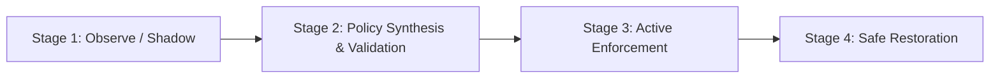

# Workstation Developer Workflow Guide

This guide walks you through the recommended 4-stage workstation security lifecycle: **Observe (Shadow Mode) &rarr; Validate &rarr; Enforce &rarr; Restore**.

---

## The 4-Stage Lifecycle


```mermaid
graph LR
    A[Stage 1: Observe / Shadow] --> B[Stage 2: Policy Synthesis & Validation]
    B --> C[Stage 3: Active Enforcement]
    C --> D[Stage 4: Safe Restoration]
```

---

## Stage 1: Observe (Shadow Mode)

In **Shadow Mode**, Agent Control records every tool call, parameter, response, and theoretical policy verdict into `~/.agentcontrol/audit.jsonl` **without blocking any traffic**. This allows developers to use their agents normally and observe what tools they actually invoke.

### Start Shadow Gateway
```bash
agentcontrol start --standalone --shadow
```

### Connect a Target Assistant (New Terminal)
```bash
agentcontrol connect cursor
```

### Inspect Recorded Events
1. Open the Local Dashboard at `http://127.0.0.1:18080`.
2. Inspect tool invocations, parameters, and simulated policy verdicts.

---

## Stage 2: Policy Synthesis & Validation

Rather than writing security policies manually from scratch, synthesize a baseline policy directly from your observed shadow traffic:

### 1. Synthesize Policy YAML
```bash
agentcontrol generate-policy --output agentcontrol-policy.yaml
```
This reads observed tool calls from `~/.agentcontrol/events.db` and drafts allowed tools, parameter boundaries, and rate limits.

### 2. Lint and Inspect Policy
```bash
agentcontrol lint agentcontrol-policy.yaml
```

### 3. Test Policy Against Fixtures
```bash
agentcontrol validate --policy agentcontrol-policy.yaml --tool execute_command --payload test_payload.json
```

---

## Stage 3: Active Enforcement

Once you are satisfied with your policy rules:

### Launch with Active Enforcement
```bash
agentcontrol start --policy agentcontrol-policy.yaml
```

### What Happens in Enforcement Mode
- **DLP Violations:** Tool calls containing AWS keys, private SSH keys, or secrets are intercepted and returned with a policy denial error before reaching the tool.
- **Prompt Injection:** Input containing jailbreak / system prompt override heuristics is blocked with verdict `DENY`.
- **Recursion / Loop Prevention:** Excessive circular tool calls are halted before draining your API budget.

### Verify Active Enforcement & Posture
In another terminal:
```bash
# Check current protection profile across all IDE targets:
agentcontrol status

# Run the automated security verification probe:
agentcontrol verify
```

#### Understanding Your Protection Posture (FR-P0-1):
- `ENFORCED`: The operation is affirmatively inspected and blocked before reaching downstream tools (e.g. wrapped MCP tools).
- `OBSERVED`: Traffic is inspected in shadow mode; operations are permitted.
- `UNCOVERED`: No interception path exists for this route (e.g. Claude Desktop direct cloud completions, native OS shell execution in Codex). Pair Vexa with container/OS-level isolation for uncovered vectors.
- `UNKNOWN / UNHEALTHY`: The proxy daemon is stopped or configuration is unmanaged.

---

## Stage 4: Safe Restoration

When you finish your evaluation or need to revert your configuration:

```bash
# Disconnect all configured IDE targets:
agentcontrol disconnect --all

# Stop the daemon:
agentcontrol stop

# Verify target status (should show UNCOVERED / UNMANAGED):
agentcontrol status
```

---

## Next Steps

- [Docker Deployment Guide](docker-deployment.md) — Run standalone container or full stack with zero host installation.
- [Custom Agent HTTP Guide](custom-agent-http.md) — Route LangChain, CrewAI, or Python/TS agent scripts.
- [Small Team Hub Guide](small-team-hub.md) — Deploy shared team policies and centralized audit logs via Docker Compose.
