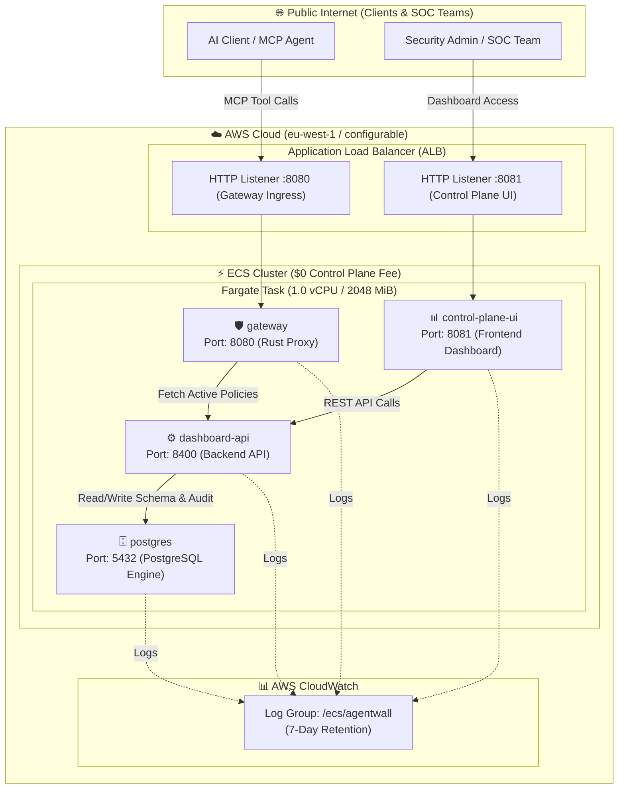

# 🛡️ AgentWall on AWS (ECS Fargate)

Production-ready, highly cost-effective (~$15–$25/month) serverless deployment of **AgentWall** and its Enterprise Control Plane on **Amazon Web Services (AWS)** using **AWS ECS Fargate** and an Application Load Balancer (ALB).

---

## 📐 Architecture Overview



---

## 💰 Cost Comparison: AWS ECS Fargate vs EKS vs Self-Managed EC2

| Component / Cost Factor | AWS ECS Fargate (This Module) | AWS EKS (Kubernetes) | Self-Managed EC2 (Single VM) |
| :--- | :--- | :--- | :--- |
| **Control Plane Fee** | **$0.00 / month** | $73.00 / month | $0.00 / month |
| **Load Balancing** | ~$16 – $20 / month (ALB) | ~$16 – $20 / month (ALB) | $0.00 (Direct IP / Nginx) |
| **Compute Sizing** | 1 × Fargate Task (1.0 vCPU, 2.0 GiB) | Minimum 2 Nodes + System Pods | 1 × t4g.medium / t4g.large |
| **Maintenance Burden** | **Zero OS/Node patching** | High (Node upgrades, AMI cycles) | High (Manual OS security patching) |
| **Logging & Metrics** | <$1.00 / month (CloudWatch) | ~$5 – $10 / month (Container Insights) | Local disk / CloudWatch Agent |
| **ESTIMATED MONTHLY COST** | **~$15 – $25 / month** | **~$120 – $150 / month** | **~$30 – $45 / month** |

---

## 💻 Cross-Platform Prerequisites & Setup

This deployment runs seamlessly across **Windows**, **Linux**, and **macOS** with zero OS-specific dependencies.

### 1. Install Terraform (`>= 1.6.0`)
- **Windows (PowerShell / winget / choco):**
  ```powershell
  winget install HashiCorp.Terraform
  # or: choco install terraform
  ```
- **macOS (Homebrew):**
  ```bash
  brew tap hashicorp/tap
  brew install hashicorp/tap/terraform
  ```
- **Linux (Debian / Ubuntu / RHEL):**
  ```bash
  sudo apt-get update && sudo apt-get install -y gnupg software-properties-common curl
  curl -fsSL https://apt.releases.hashicorp.com/gpg | sudo gpg --dearmor -o /usr/share/keyrings/hashicorp-archive-keyring.gpg
  echo "deb [signed-by=/usr/share/keyrings/hashicorp-archive-keyring.gpg] https://apt.releases.hashicorp.com $(lsb_release -cs) main" | sudo tee /etc/apt/sources.list.d/hashicorp.list
  sudo apt-get update && sudo apt-get install terraform
  ```

### 2. Install AWS CLI v2 & Authenticate
- **Windows:** `winget install Amazon.AWSCLI`
- **macOS:** `brew install awscli`
- **Linux:**
  ```bash
  curl "https://awscli.amazonaws.com/awscli-exe-linux-x86_64.zip" -o "awscliv2.zip"
  unzip awscliv2.zip && sudo ./aws/install
  ```
- **Authenticate with AWS:**
  ```bash
  aws configure
  # Enter AWS Access Key ID, Secret Access Key, and default region (e.g. eu-west-1 or us-east-1)
  ```

---

## 🚀 Quick Start Deployment

All Terraform configurations for AWS ECS Fargate reside in `infra/aws/ecs/`.

### On Windows (PowerShell):
```powershell
cd infra/aws/ecs

# Initialize Terraform providers
terraform init

# Review execution plan
terraform plan

# Apply and deploy infrastructure
terraform apply
```

### On Linux or macOS (Bash / Zsh):
```bash
cd infra/aws/ecs

# Initialize Terraform providers
terraform init

# Review execution plan
terraform plan

# Apply and deploy infrastructure
terraform apply
```

---

## 🔍 Post-Deployment Validation Suite (Across All OS Types)

Once `terraform apply` finishes, the ALB public endpoints will be displayed in the outputs:

```text
Apply complete! Resources: 18 added, 0 changed, 0 destroyed.

Outputs:

control_plane_url      = "http://agentwall-ecs-alb-123456789.eu-west-1.elb.amazonaws.com:8081"
dashboard_url          = "http://agentwall-ecs-alb-123456789.eu-west-1.elb.amazonaws.com:8080"
health_url             = "http://agentwall-ecs-alb-123456789.eu-west-1.elb.amazonaws.com:8080/healthz"
ecs_cluster_name       = "agentwall-cluster"
ecs_service_name       = "agentwall-service"
container_image_in_use = "ghcr.io/noviqtechnologies/agentwall:latest"
```

### Step 1: Verify Gateway Health Check

- **Windows (PowerShell):**
  ```powershell
  Invoke-RestMethod -Uri "http://<ALB-DNS-NAME>:8080/healthz"
  ```
- **Linux / macOS (Bash / Zsh) & Windows CMD:**
  ```bash
  curl -i http://<ALB-DNS-NAME>:8080/healthz
  ```
*Expected response: `HTTP 200 OK`*

### Step 2: Validate Policy Interception & Security Guardrails

Send test JSON-RPC MCP tool calls to the AWS ALB gateway endpoint:

- **Windows (PowerShell):**
  ```powershell
  # 1. Test blocked dangerous tool call (Default-Deny / Safe Mode)
  $blockedBody = '{"jsonrpc":"2.0","id":1,"method":"tools/call","params":{"name":"execute_command","arguments":{"command":"rm -rf /"}}}'
  Invoke-RestMethod -Uri "http://<ALB-DNS-NAME>:8080" -Method Post -Headers @{ "Content-Type" = "application/json"; "Authorization" = "Bearer test-token" } -Body $blockedBody

  # 2. Test safe authorized tool call
  $safeBody = '{"jsonrpc":"2.0","id":2,"method":"tools/call","params":{"name":"list_directory","arguments":{"path":"/workspace"}}}'
  Invoke-RestMethod -Uri "http://<ALB-DNS-NAME>:8080" -Method Post -Headers @{ "Content-Type" = "application/json"; "Authorization" = "Bearer test-token" } -Body $safeBody
  ```

- **Linux / macOS (Bash / Zsh):**
  ```bash
  # 1. Test blocked dangerous tool call
  curl -X POST http://<ALB-DNS-NAME>:8080 \
    -H "Content-Type: application/json" \
    -H "Authorization: Bearer test-token" \
    -d '{"jsonrpc":"2.0","id":1,"method":"tools/call","params":{"name":"execute_command","arguments":{"command":"rm -rf /"}}}'

  # 2. Test safe authorized tool call
  curl -X POST http://<ALB-DNS-NAME>:8080 \
    -H "Content-Type: application/json" \
    -H "Authorization: Bearer test-token" \
    -d '{"jsonrpc":"2.0","id":2,"method":"tools/call","params":{"name":"list_directory","arguments":{"path":"/workspace"}}}'
  ```

### Step 3: Access Enterprise Control Plane UI
Open your browser and navigate to:
```text
http://<ALB-DNS-NAME>:8081
```

### Step 4: Stream Live CloudWatch Container Logs (AWS CLI)
```bash
# Windows PowerShell, macOS, or Linux
aws logs tail /ecs/agentwall --follow --format short
```

---

## ⚙️ Advanced Customization

You can override default settings by passing `-var` flags or creating a `terraform.tfvars` file inside `infra/aws/ecs/`:

```hcl
aws_region       = "eu-west-1"
environment      = "prod"
app_name         = "agentwall"
fargate_cpu      = 1024
fargate_memory   = 2048
agentwall_image  = "ghcr.io/noviqtechnologies/agentwall:latest"
```

---

## 🧹 Teardown & Clean Up

To delete all provisioned AWS resources cleanly and stop billing:
```bash
cd infra/aws/ecs
terraform destroy
```
