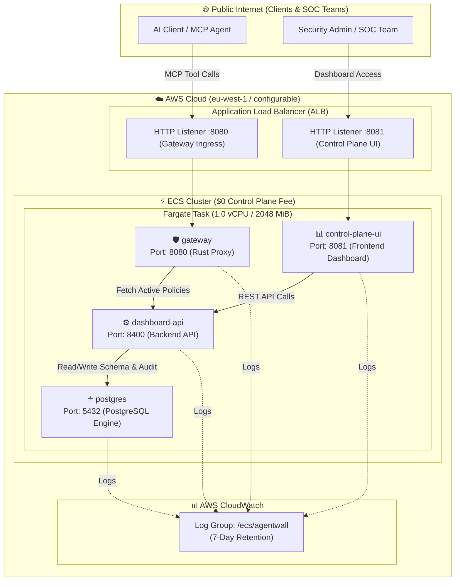

# 🛡️ AgentWall on AWS (ECS Fargate)

Production-ready, cost-effective (~$15–$25/month) serverless deployment of **AgentWall** and its Enterprise Control Plane on **Amazon Web Services (AWS)** using **AWS ECS Fargate** and an Application Load Balancer (ALB).

---

## 📐 Architecture Overview



---

## 💰 Cost Efficiency

| Component | Architecture Detail | Monthly Cost |
| :--- | :--- | :--- |
| **Control Plane** | AWS ECS (No cluster management fee) | **$0.00** |
| **Compute** | 1 × Fargate Task (1.0 vCPU, 2.0 GiB) running 24/7 | **~$15 – $20 / month** |
| **Networking** | Public Subnets (Direct IGW routing, zero NAT Gateway fees) | **$0.00** |
| **Load Balancing** | AWS Application Load Balancer (ALB) | **~$16 – $20 / month** |
| **Logging** | AWS CloudWatch Logs (7-day retention) | **<$1.00 / month** |
| **TOTAL** | **Full Enterprise Control Plane + Gateway Stack** | **~$15 – $25 / month** |

---

## 💻 Prerequisites

- **Terraform** (`>= 1.6.0`)
- **AWS CLI** configured with appropriate deployment credentials (`aws configure`)

---

## 🚀 Quick Start Deployment

All Terraform configurations for AWS ECS Fargate reside in `infra/aws/ecs/`.

### On Windows (PowerShell):
```powershell
cd infra/aws/ecs

# Initialize Terraform providers
terraform init

# Review execution plan
terraform plan

# Apply and deploy infrastructure
terraform apply
```

### On Linux or macOS (Bash / Zsh):
```bash
cd infra/aws/ecs

# Initialize Terraform providers
terraform init

# Review execution plan
terraform plan

# Apply and deploy infrastructure
terraform apply
```

---

## 🔍 Verification & Endpoints

Once `terraform apply` finishes, the ALB public endpoints will be displayed in the outputs:

```text
Outputs:

control_plane_url      = "http://agentwall-ecs-alb-123456789.eu-west-1.elb.amazonaws.com:8081"
dashboard_url          = "http://agentwall-ecs-alb-123456789.eu-west-1.elb.amazonaws.com:8080"
health_url             = "http://agentwall-ecs-alb-123456789.eu-west-1.elb.amazonaws.com:8080/healthz"
ecs_cluster_name       = "agentwall-cluster"
ecs_service_name       = "agentwall-service"
container_image_in_use = "ghcr.io/noviqtechnologies/agentwall:latest"
```

### 1. Verify Gateway Health
```bash
curl -i http://<ALB-DNS-NAME>:8080/healthz
```
*Expected response: `HTTP 200 OK`*

### 2. Access Enterprise Control Plane UI
Open your browser and navigate to:
```text
http://<ALB-DNS-NAME>:8081
```

---

## 🧹 Teardown & Clean Up

To delete all provisioned AWS resources cleanly:
```bash
cd infra/aws/ecs
terraform destroy
```
